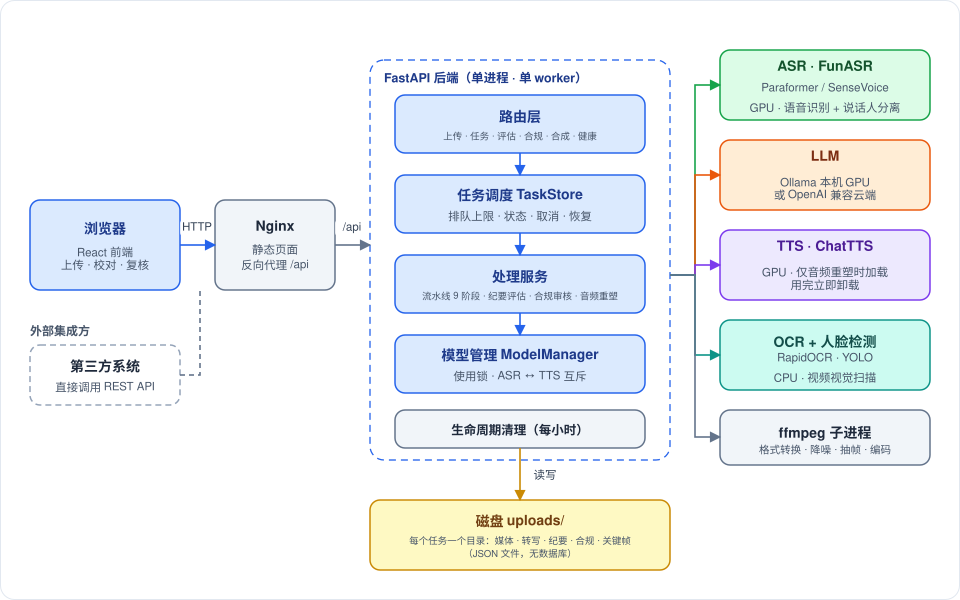

# Copernicus

音视频智能听写与合规审核工作台。上传一段会议或产品说明会的录音/录像，系统自动完成：**语音转写（带说话人与时间戳）→ 文本纠正 → 会议纪要**，并可选做**合规审核**（转写文本 + 画面文字）与**多说话人对话音频合成**。

**技术栈**：后端 FastAPI + FunASR（Paraformer / SenseVoice）+ Ollama 或 OpenAI 兼容 LLM + ChatTTS + RapidOCR + YOLO；前端 React 19 + TypeScript + Vite + Zustand + DaisyUI。

## 仓库结构

| 目录 | 内容 |
|---|---|
| `backend/` | FastAPI 后端（Python ≥ 3.12，用 pyenv 管理）；`scripts/` 里有模型下载、FunASR 补丁、打包脚本 |
| `frontend/` | React 前端（开发端口 3000，已配置 `/api` 代理到 8000） |
| `deploy/` | 生产部署：`install.sh` / `uninstall.sh` 与 systemd、Nginx 配置模板 |
| `docs/` | 文档（见下方导航），图片在 `docs/assets/`（全部为 SVG） |
| `logs/` | 开发日志（每 8 小时一个文件，已 gitignore） |

## 快速开始

**本地开发**

1. 后端：进入 `backend/`，按 `.env.example` 准备 `.env`（LLM 地址、ASR 模式等）；模型可用 `scripts/download_models.py` 预下载（ChatTTS、YOLO 权重需手动放入 `models/`）；运行 `python run_dev.py`（端口 8000）。
2. 前端：进入 `frontend/`，`npm install && npm run dev`（端口 3000）。依赖锁只有 `package-lock.json`，本地、CI 与部署脚本统一用 npm。
3. 检查：后端在 `backend/` 下运行 `ruff check src tests` 与 `pytest -q`（全部用假对象，**不需要 GPU、模型或 LLM**）；前端在 `frontend/` 下运行 `npx tsc -b`、`npm run lint`、`npm test`。GitHub Actions 会在推送与 PR 时运行同样的检查，并对部署脚本做 ShellCheck 与 dry-run。

**生产部署**：装好显卡驱动、ffmpeg、Node.js、Nginx、Ollama 后，在仓库根目录以 root 执行 `deploy/install.sh`（建议先加 `--dry-run` 预演）；卸载用 `deploy/uninstall.sh`。详见 [部署指南](docs/intro/deployment.md)。

## 文档导航

所有现状文档都在 `docs/intro/`，与代码同步维护，图一律用 SVG。

| 文档 | 讲什么 | 适合谁 |
|---|---|---|
| [features.md](docs/intro/features.md) | 系统能做什么：从上传到纪要、合规、音频合成的完整链路，界面与快捷键 | 所有人，**建议第一篇读** |
| [backend-architecture.md](docs/intro/backend-architecture.md) | 后端架构：分层、流水线、任务调度、纪要/合规/合成、LLM 客户端、存储与配置、设计决策 | 后端开发 |
| [frontend-architecture.md](docs/intro/frontend-architecture.md) | 前端架构：分层、状态管理、关键数据流、播放器与审核工作台、性能设计 | 前端开发 |
| [third-party-integration.md](docs/intro/third-party-integration.md) | REST API 接入指南：最小集成三步、端点参考、错误处理与重试建议 | 外部集成方 |
| [concurrency-capacity.md](docs/intro/concurrency-capacity.md) | 并发与排队、显存切换、容量上限、省电与效率设计、调优参数 | 运维 / 性能调优 |
| [deployment.md](docs/intro/deployment.md) | 部署与运维：一键安装/卸载、模型准备、配置、升级与排错 | 运维 |

其他目录：

- `docs/study/`：以本项目**早期版本**源码为教材的 Python 与 React 学习笔记，代码片段与当前源码有出入，只读概念，以源码为准。
- `docs/back/`、`docs/front/`、`docs/prob/`：本地存放的早期设计归档与旧部署文档（未纳入 git）。设计归档反映当时的状态，仅供了解演进过程；`docs/prob/deployment-centos.md` 含有裸机准备的手工步骤（换源、驱动、pyenv 等），可作为 `deployment.md` 第二节前置条件的补充参考，其中的 systemd/Nginx 样例已被 `deploy/templates/` 取代。

### 推荐阅读路径

- **新成员上手**：`features.md` → 按方向读 `backend-architecture.md` 或 `frontend-architecture.md`
- **外部系统对接**：`third-party-integration.md`
- **部署上线**：`deployment.md` → `concurrency-capacity.md`

## 当前状态与已知限制

- 已在带 GPU 的开发机上做过端到端冒烟（上传→转写→工作区→历史→合成→审核复核）；**尚未在生产机器（Rocky Linux + RTX 2080 Ti）上完整验证部署脚本**，GitHub Actions 工作流也尚未在 GitHub 上真实运行。
- 没有鉴权，请部署在内网或网关之后。
- 合规审核只有 13 条内置规则，证据来源只有转写与 OCR，没有评测集，无法给出准确率；人脸检测结果目前不参与判定。
- 纪要正文是自由文本；行动项与决议由单独的一次 LLM 调用提取（可回溯到转写时间点），提取质量尚未用真实模型评估。

完整列表见各文档末尾的"已知限制"。
