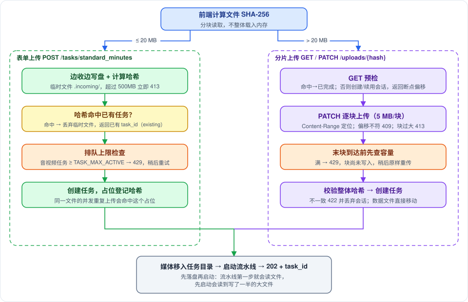
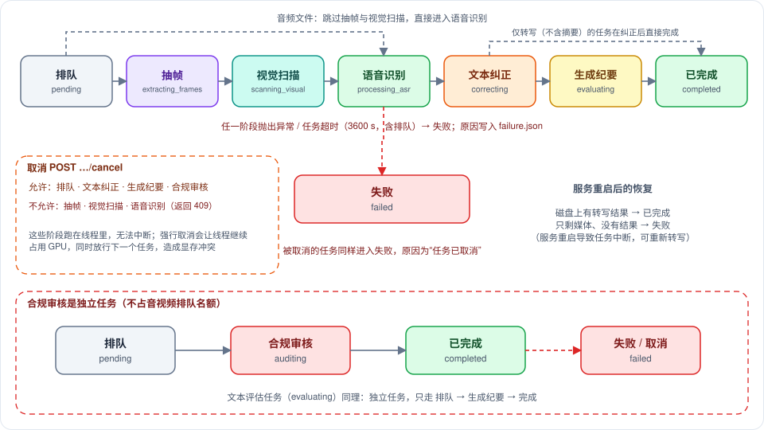
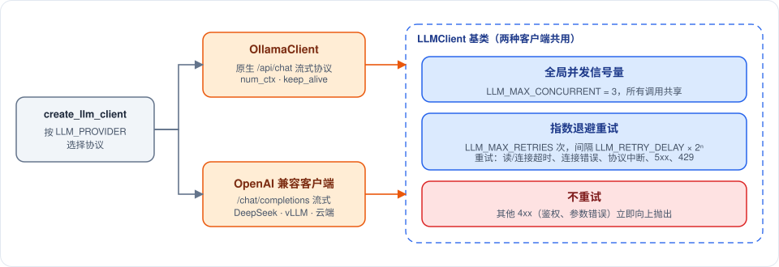
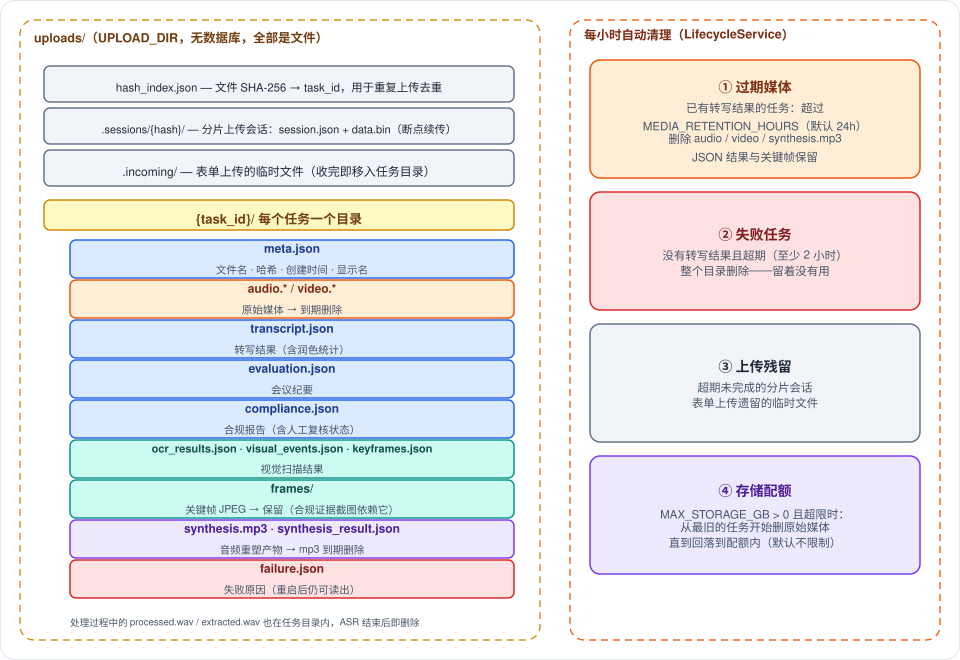

# Copernicus 后端架构

> 作者: afu
>
> **一句话**：后端是一个单进程 FastAPI 服务，把上传的音视频变成"转写文本 + 会议纪要 + 合规报告 + 对话音频"，中间用到 GPU 上的语音识别、本机或云端的大模型，结果全部以文件形式存在磁盘上。
>
> **适合谁读**：要改后端代码、排查线上问题或做二次开发的人。只想调接口请读 `third-party-integration.md`；想知道能做什么请读 `features.md`；部署请读 `deployment.md`；并发与显存请读 `concurrency-capacity.md`。

---

## 一、先看整体

后端由三层组成，依赖方向只能自上而下：

| 层 | 目录 | 职责 |
|---|---|---|
| 路由层 | `routers/` | 接收 HTTP 请求、校验参数、把领域异常翻译成状态码；不含业务逻辑 |
| 服务层 | `services/` | 全部业务：任务调度、流水线、纠错、纪要、合规、合成、模型与磁盘管理 |
| 工具层 | `utils/`、`schemas/` | 纯函数（文本处理、ffmpeg 封装、哈希、JSON 提取）与 Pydantic 数据模型 |

服务实例在启动时创建一次，挂在 `app.state` 上，路由通过 `dependencies.py` 里的依赖函数取用，所以测试时可以整体替换成假对象。

**为什么是单进程、单 worker**：任务状态放在进程内存里，GPU 也只有一块；多 worker 会让状态与显存锁无法共享。要扩展应当横向部署多个独立实例，各带自己的 GPU 与数据目录。

**为什么没有数据库**：一个任务的所有产物（转写、纪要、合规、关键帧）都是"整体读、整体写"的文档，按任务目录存 JSON 文件足够，也方便人工检查与备份。代价是列表查询要遍历目录（已放入工作线程，任务数到万级以上时需要改用索引）。

---

## 二、代码目录速查

| 路径 | 内容 |
|---|---|
| `main.py` | 应用入口：生命周期（启动预检、创建服务、关停收尾）、CORS、请求追踪中间件 |
| `config.py` | 全部配置（pydantic-settings，读环境变量与 `.env`），含派生路径与模型清单 |
| `logging_setup.py` | 日志初始化：带 request_id 的格式，输出到 stderr（journald）或文件 |
| `request_context.py` | 请求追踪：为每个请求分配 request_id，写入响应头与每条日志 |
| `error_handlers.py` | 领域异常到 HTTP 响应的统一映射 |
| `routers/` | `task`（任务全生命周期）、`upload`（分片上传）、`evaluation`（文本评估与模板）、`compliance`（合规）、`synthesis`（音频重塑）、`transcription`（健康检查） |
| `services/pipeline/` | 流水线：`orchestrator` 顺序执行，`base` 定义上下文与阶段协议，`stages/` 是 9 个阶段 |
| `services/task_store.py`、`task_state.py` | 任务调度与内存状态（提交、排队上限、取消、超时、重启恢复） |
| `services/task_executor.py` | 各类任务的执行体：管线状态切换、摘要、合规审核（与调度分离，便于单独测试） |
| `services/asr/` | 语音识别包：`service`（两种模式的加载与推理）、`diarization`（声纹聚类分离说话人）、`text_cleanup`、`segment_builders`、`model_loading`、`types` |
| `services/corrector/`、`text_corrector.py`、`hotword_replacer.py` | 四阶段文本纠正 |
| `services/evaluator.py`、`template_manager.py` | 纪要生成与模板管理 |
| `services/minutes_structure.py` | 纪要结构化：提取行动项与决议，并回溯到转写时间点 |
| `metrics.py`、`routers/metrics.py` | Prometheus 文本指标（无第三方依赖）与 `/metrics` 端点 |
| `services/compliance*.py`、`rule_registry.py` | 合规审核、过滤器链、内置规则库、Excel 导出 |
| `services/synthesis.py`、`tts.py` | 音频重塑（服务编排 + ChatTTS 推理） |
| `services/llm/` | LLM 客户端（Ollama / OpenAI 兼容）：并发限流与重试 |
| `services/model_manager.py` | GPU 模型的加载、卸载与互斥 |
| `services/persistence.py`、`upload_session.py`、`lifecycle.py` | 磁盘持久化、分片上传会话、过期清理 |
| `services/preflight.py` | 启动预检（模型文件、LLM 可达性等），只警告不阻止启动 |
| `services/audio.py`、`ocr.py`、`face_detector.py` | ffmpeg 转换、RapidOCR、YOLO 人脸检测 |
| `scripts/` | `download_models.py`（预下载模型）、`patch_funasr.py`（给 FunASR 打补丁）、`build_package.py`（打包） |

---

## 三、启动与关闭

启动（`lifespan`）按依赖顺序执行，任何一步失败都会让服务启动失败：

1. **启动预检**：检查 ASR 模型文件、ChatTTS 文件、LLM 是否可达、FunASR 补丁是否已应用。**全部只是警告**，日志里用醒目的分隔线标出，方便运维一眼看到缺什么。
2. **环境变量**：设置线程数（`OMP_NUM_THREADS` 等，可被外部环境覆盖）、显存分配策略、`MODELSCOPE_CACHE`（默认跟随 `MODELS_DIR`）。这些必须在导入 torch 之前完成。
3. **LLM 客户端**：按 `LLM_PROVIDER` 创建 Ollama 或 OpenAI 兼容客户端。
4. **基础服务**：音频转换、ASR（此时把模型加载进显存）、MacBERT 纠错器、热词替换器。
5. **模型管理器**：把 ASR 登记为"已加载"，TTS 登记加载器；流水线要用它来串行使用 ASR。
6. **流水线**：注册 9 个阶段（OCR 与人脸检测是否启用由配置决定）。
7. **上层服务**：模板管理、纪要评估、合规审核；然后是任务存储（并从磁盘恢复历史任务）、音频重塑服务。
8. **后台清理**：启动时立即清理一次，之后每小时一次。

关闭时：先取消所有后台任务并等待其收尾（被取消的任务记为"任务已取消"），再取消音频重塑的后台协程，停止清理循环，最后关闭 LLM 连接池。systemd 给 60 秒收尾时间。

**重启后的任务恢复**：任务状态在内存里，重启就丢了，所以启动时会扫描磁盘：有转写结果的恢复为"已完成"；只剩媒体、没有结果的（失败或被重启打断）恢复为"失败"，原因取自 `failure.json`，没有则写"服务重启导致任务中断"，用户可以重新转写。恢复失败的任务不再按文件哈希复用，重新上传会新建任务。

---

## 四、任务是怎么被创建和推进的

### 4.1 上传与创建

要点：

- **不整体读入内存**：表单上传边接收边写到 `.incoming/` 临时文件并同时计算 SHA-256；分片上传的数据文件在末块到达后直接移入任务目录。内存占用不随文件大小增长。
- **先落盘、再启动**：任务创建后先把媒体移入任务目录，然后才启动流水线。流水线第一步就会读取这个文件，反过来顺序会让它读到只写了一半的大文件（这是审计中发现并修复的真实缺陷）。
- **去重**：相同 SHA-256 命中已有任务就直接返回它（`existing=true`）；创建任务时先"占位登记"哈希，落盘期间到达的重复上传也会命中这个占位。失败的任务不参与复用。
- **准入控制**：排队加运行中的音视频任务达到 `TASK_MAX_ACTIVE`（默认 5）时返回 429，而不是让它排队到超时。分片上传的末块会**先查容量再写入**；即使校验后才被拒绝，也会把刚写入的末块撤销，客户端可以原样重传。
- **父任务校验**：文本评估与合规审核可以带 `parent_task_id`，把结果写回那个任务；父任务不存在时立即返回 404，而不是算完 LLM 才发现没地方保存。

### 4.2 任务状态

`TaskStore` 为每个任务在内存里保存一个 `TaskInfo`（状态、当前批次、结果、错误），并持有它的后台协程句柄：

- **超时**：每个任务协程外层有 `TASK_TIMEOUT_SECONDS`（默认 3600 秒）的超时，**包含排队等 GPU 的时间**。
- **等待 ASR**：ASR 一次只服务一个任务。轮到语音识别阶段时若模型被占用，任务状态变为 `queued_asr`（进度仍显示 20%），拿到锁后才变为 `processing_asr`。状态由编排器在每个阶段开始时通知外层切换，不依赖阶段自己上报进度。
- **取消**：只允许取消"排队 / 等待识别 / 文本纠正 / 生成纪要 / 合规审核"。ASR 与视觉扫描跑在线程里，无法中断；强行取消会让线程继续占着 GPU 而协程已退出，下一个任务就会并行占用 GPU。这类阶段返回 409。
- **保护**：运行中的任务不能被作废（`DELETE`）或删除（`purge`），返回 409。
- **内存淘汰**：内存里最多 `TASK_MAX_IN_MEMORY`（默认 500）个任务，超出时淘汰最早结束的；被淘汰的任务再次被访问时会从磁盘惰性恢复。
- **进度换算**：百分比由状态与批次进度换算，见下图；失败任务不显示进度。

---

## 五、处理流水线

流水线是"阶段协议 + 上下文 + 编排器"的组合，属于**管道-过滤器**模式：

| 概念 | 说明 |
|---|---|
| 阶段（Stage） | 三个要素：名称、`should_run`（是否跳过）、`execute`（执行）。新增处理步骤只需实现协议并注册，不改编排器 |
| 上下文（PipelineContext） | 阶段之间共享的数据：媒体路径、转换后的 WAV、识别结果、纠正结果、转写条目、关键帧、OCR 结果、计时等。**只携带文件路径，不携带文件内容** |
| 编排器（Orchestrator） | 按注册顺序执行；某阶段 `should_run` 为假就跳过；为每个阶段包装进度回调并记录耗时；阶段抛出的异常会带上阶段名向上传 |
| 外观（PipelineService） | 对外唯一入口，负责注册阶段、合并全局热词与请求热词、把阶段切换通知给任务存储以更新状态 |

各阶段的行为：

| 阶段 | 做什么 | 何时跳过 |
|---|---|---|
| 视频预处理 | ffmpeg 从视频提取 16kHz 单声道 WAV（可选降噪滤镜链），标记为视频任务 | 文件不是视频 |
| 关键帧提取 | 按固定间隔（默认 2 秒）或场景切换抽帧，超过 500 张时均匀抽样；场景模式使用 ffmpeg 报告的真实时间戳 | 非视频，或未勾选"视觉扫描" |
| OCR 扫描 | RapidOCR（CPU）逐帧识别文字，过滤低置信度与过短的文本 | 无关键帧或 OCR 未启用 |
| 人脸检测 | YOLO（CPU）逐帧检测，合并成"出现/缺失"事件，忽略短暂缺失 | 无关键帧或未启用 |
| 音频预处理 | 任意音频转 16kHz 单声道 WAV，输出放在任务目录内 | 视频已提取出 WAV |
| ASR 识别 | 在 ModelManager 的 ASR 使用锁保护下，于工作线程中运行识别 | 无 WAV |
| 说话人平滑 | 合并抖动的说话人标签，预合并相邻的同人句段 | 无识别结果 |
| 文本纠正 | 只处理低置信度句段（默认阈值 0.95），四阶段纠正 | 无句段 |
| 转写构建 | 按标点拆成句子，按字数比例分配时间戳，剔除纠正后为空的句段，写入 `transcript.json` | 无结果 |

**关键设计点**

1. **文件在磁盘上传路径**：媒体、WAV 都以路径传递。音频与视频共用同一条 ffmpeg 转换命令（`AudioService.extract_wav`），改滤镜只需改一处。
2. **ASR 阶段的取消语义**：识别在线程里，被取消时协程会退出，但线程还在跑。所以"持锁 + 推理"放在一个独立任务里：外层被取消时，如果还在排队就直接放弃；如果线程已开始，就让它跑完再释放锁，临时 WAV 也等线程结束才清理。
3. **视觉推理串行**：OCR 与 YOLO 的模型内部各有一把锁。多个视频任务同时推理只会互相抢 CPU 核，串行既安全（YOLO 实例不保证线程安全）也更省电。
4. **不可信的中间产物不入库**：`processed.wav`、`extracted.wav` 在 ASR 结束后即删除。

### 5.1 语音识别（services/asr/）

| 模式 | 适用 | 做法 |
|---|---|---|
| Paraformer（默认） | 多人对话，需要说话人 | seaco_paraformer + VAD + 标点恢复 + CAM++ 说话人，一次推理输出带说话人的句段；支持热词 |
| SenseVoice | 嘈杂环境 | SenseVoice 识别 + VAD，再用 CAM++ 声纹做滑动窗口聚类分离说话人；对超长句段按标点与时长拆分 |

两种模式都会过滤纯语气词、英文幻觉短语等无效识别。说话人在转写里显示为 `Speaker 1`、`Speaker 2`…，可在前端重命名或合并。

需要的模型由 `Settings.required_asr_model_ids` 统一给出（预检、下载脚本、加载逻辑共用这一份清单）。FunASR 需要打三处补丁（输出逐字置信度、缓存热词解析），没有补丁时置信度过滤失效，所有句段都会送去 LLM，耗时可增加数十倍——`scripts/patch_funasr.py` 幂等，升级 FunASR 后必须重跑。

### 5.2 四阶段文本纠正

- ①②③ 是本机计算，成本低；④ 才调用 LLM，并且只处理 ASR 置信度低的句段。
- ③ 的 MacBERT 模型首次调用时才加载，推理与热词替换都在工作线程里执行，不会卡住事件循环。
- LLM 批次的失败会被**计数并暴露给用户**：转写结果里带 `correction_total_batches` 与 `correction_failed_batches`，前端据此显示警示。

---

## 六、纪要生成

模板是 `templates/` 下的 Markdown 文件（YAML 头声明 `id`、`name`、`description`，正文是给模型的提示词），内置 5 个：通用（默认）、夕会、周例会、公文、简报摘要。`POST /templates/reload` 可热重载。

任务类型有两种：**标准纪要任务**在转写完成后自动生成摘要；**文本评估任务**（`/evaluate/text/async`）直接接收文本，结果写回 `parent_task_id` 指定的任务。

标准纪要任务里，**摘要失败不会让任务失败**：转写已经落盘，任务保持"已完成"，只记一条警告；同一文件再次上传仍会复用它，前端发现没有摘要会自动重新生成。（旧版本会把整个任务标为失败，导致内存状态与重启后的磁盘状态不一致。）

不完整的结果会带标记：`truncated`（超过 50000 字被截断）、`degraded_chunks`（有片段的要点提炼失败）。

**结构化提取**（`MINUTES_STRUCTURE_ENABLED`，默认开启）：排版纪要之外，再用一次独立的 LLM 调用从转写里提取**行动项**（事项、负责人、时间要求）与**决议**。转写按 `EVALUATION_CHUNK_SIZE` 分块，每块一次调用，结果合并去重。

时间点的回溯不让模型报时间——模型不擅长——而是要求它给出一句从原文摘抄的"引文"，由服务端在转写里匹配：先找单句包含，再找相邻两句拼接，最后按序匹配字数占比 ≥ 60% 的模糊匹配；匹配不到时间点为空，不会给出错误的时间。结果写入 `evaluation` 的 `action_items`、`decisions`，`structure_status` 说明完整性（`ok` / `partial` / `failed` / `skipped`）。提取失败只降级为"未提取"，不影响纪要本身；"重新评估"时会读取父任务已保存的转写来做回溯。

---

## 七、合规审核

- **规则来源**：上传 CSV / XLSX（依次尝试 utf-8-sig、utf-8、gbk、gb18030 编码；A 列是规则，B–G 列是历史违规案例，用作 few-shot 示例）。规则会按内容关键词匹配到 13 条内置规则（产说会合规场景），得到检查模式与证据来源；匹配不上的按"语义审核"处理。
- **证据来源只有两路**：转写文本与 OCR 屏幕文字。没有 OCR 数据时，只依赖屏幕文字的规则被跳过，**规则编号写入报告的 `skipped_rule_ids`**，前端提示"这些规则未被审核"，避免"跳过"被误读成"通过"。人脸检测事件会保存但**不参与**合规判定。
- **重试语义**：LLM 调用失败由 LLM 客户端负责重试；审核层只在"输出不是合法 JSON"时重问一次，避免两层重试叠加成 6 次请求。
- **过滤器链**：置信度过滤（默认 0.7）→ 精确词校验（关键词类规则用正则与拼音窗口二次确认，能纠正 LLM 的误报与漏报）→ 去重合并（同规则 30 秒内）→ 补充 OCR 证据。
- **评分**：100 分起扣，高 15、中 8、低 3；人工"忽略"的条目不扣分。每次复核后由服务端重算，不信任前端传来的分数。
- **复核与留痕**：违规条目有稳定的 id（`v0001`…）；确认/忽略会记录时间与备注，改回"待审"会清空留痕；导出 Excel 时对以 `=` 等开头的文本做了公式注入防护。
- **完整性**：截断（超过 50000 字）、失败分块数、被跳过的规则都会记在报告里；全部分块失败才让任务失败。
- **隐私**：提示词与模型原始输出含被审核的对话内容，只在 DEBUG 日志级别记录。
- **本机 LLM 与显存**：使用本机 Ollama 时，审核开始前会先卸载 ASR 腾显存；使用远端 LLM 则不卸载。

---

## 八、音频重塑

`SynthesisService` 把"转写 → 对话音频"的全过程封装起来：

1. 按说话人合并相邻句段，给每个说话人分配固定的音色种子（可用 `voice_map` 覆盖）。
2. 可选：`TTS_REWRITE_ENABLED=true` 时，先用 LLM 把书面语改写成口语（默认关闭，11GB 显存机器上不建议开）。
3. 在 ModelManager 的 TTS 使用锁内独占显存：等待 ASR 使用者结束、卸载 ASR、加载 ChatTTS；分批合成（每批约 1000 字，批间清显存缓存），每次推理不超过 40 字以避免"幻读"；合成参数集中在一个参数对象里。
4. ffmpeg 拼接并编码为 192k MP3，**先写临时文件再改名**，失败不会留下残缺文件；随后立即卸载 TTS。

服务持有后台协程的引用（asyncio 只弱引用任务，不保存会被回收）并在关停时取消；准备阶段失败会把任务标为失败，不会永远停在"进行中"。

---

## 九、LLM 客户端

上层服务只依赖抽象类型。`LLM_PROVIDER=ollama`（默认）使用 Ollama 原生协议，支持 `num_ctx`、`think`、`keep_alive`；`openai` 使用 OpenAI 兼容协议（DeepSeek、vLLM 等，SSE 流式，Bearer 鉴权）。全局并发信号量让"纠正、纪要、合规"共用同一个并发预算。

---

## 十、磁盘存储与生命周期

- **原子写入**：所有 JSON 先写临时文件再改名，进程崩溃不会留下写到一半的文件；分片上传的会话元数据同样如此。
- **读不建目录**：读取接口对不存在的任务返回空，不会创建空目录（否则任意 id 的 GET 都会留下永远清不掉的目录）。写路径才创建目录。
- **哈希索引**：`hash_index.json` 记录"文件哈希 → 任务"，丢失或损坏时启动会从各任务的 `meta.json` 重建。
- **清理为什么保留关键帧**：合规报告的证据截图引用 `frames/`，随媒体一起删会让历史报告的图片失效。
- **一次扫描**：清理循环每轮只扫描并解析一次所有任务的 `meta.json`，四种策略共用。

---

## 十一、配置体系

配置由 pydantic-settings 读取，来源优先级：进程环境变量 > `backend/.env` > 代码默认值。`.env` 支持行内 `#` 注释（所以 systemd 单元不再使用 `EnvironmentFile`，直接让程序读 `.env`）。**键名拼错或已删除的键会导致启动报错**，升级时注意；`CORRECTION_OVERLAP` 已废弃但字段保留，以免旧 `.env` 报错。

| 类别 | 关键项（默认值） | 说明 |
|---|---|---|
| LLM | `LLM_PROVIDER`（ollama）、`LLM_BASE_URL`、`LLM_MODEL_NAME`、`LLM_TIMEOUT`（120s）、`LLM_MAX_RETRIES`（2）、`LLM_MAX_CONCURRENT`（3） | 协议、地址、超时、重试、全局并发 |
| Ollama | `OLLAMA_NUM_CTX`（32768）、`OLLAMA_NUM_CTX_CORRECTION`（4096）、`OLLAMA_KEEP_ALIVE`（0） | 上下文窗口与显存；`0` 表示每次调用后立即卸载模型（有意为之，见并发文档） |
| ASR | `ASR_MODE`（paraformer）、`ASR_DEVICE`（auto）、`ASR_DTYPE`、`ASR_BATCH_SIZE` | 模式、设备、精度、批大小 |
| 纠正 | `CORRECTION_CHUNK_SIZE`（800）、`CORRECTION_MAX_CONCURRENCY`（3）、`CONFIDENCE_THRESHOLD`（0.95） | 批大小、并发、跳过 LLM 的置信度线 |
| 纪要 / 合规 | `EVALUATION_*`、`COMPLIANCE_*`、`MINUTES_STRUCTURE_ENABLED`（true） | 文本上限 50000 字、分块大小、`num_ctx`、置信度阈值；是否额外提取行动项与决议 |
| 任务 | `TASK_TIMEOUT_SECONDS`（3600）、`TASK_MAX_ACTIVE`（5）、`TASK_MAX_IN_MEMORY`（500） | 超时、排队上限、内存任务数 |
| 存储 | `UPLOAD_DIR`、`MAX_UPLOAD_SIZE_MB`（500）、`MEDIA_RETENTION_HOURS`（24）、`MAX_STORAGE_GB`（0=不限）、`MODELS_DIR` | 目录、上限、保留时长、配额 |
| 视觉 | `KEYFRAME_*`、`OCR_ENABLED`、`FACE_DETECT_ENABLED` | 抽帧策略与开关 |
| TTS | `TTS_*` | 音色、停顿、每句字数、口语改写开关等 |
| 其他 | `CORS_ORIGINS`、`LOG_TO_FILE`、`VRAM_BUDGET_GB`（仅健康检查展示） | 跨域、日志、显存预算显示 |

完整清单与注释见 `backend/.env.example`（通用）与 `backend/.env.prod`（生产机器 RTX 2080 Ti 11GB 的取值）。

---

## 十二、错误处理与可观测性

**统一错误格式**：所有领域异常都返回 `{detail, code, request_id}`，响应头带 `X-Request-ID`（跨域已放行该头）。同一个 request_id 会出现在这次请求触发的所有日志里，包括它启动的后台任务日志，方便按 id 检索。

| 异常 | 状态码 | code |
|---|---|---|
| 任务不存在 / 媒体不存在 | 404 | `task_not_found` / `media_not_found` |
| 任务正忙（运行中不可删除/重转写/校对，偏移不符等） | 409 | `task_busy` |
| 标识符格式非法（非 32 位十六进制的 task_id，非 64 位的文件哈希） | 422 | `invalid_identifier` |
| 排队已满 | 429 | `queue_full` |
| 服务未配置 | 503 | `service_not_configured` |
| 其他内部错误 | 500 | `internal_error` |

**标识符校验**：task_id、文件哈希、文件名都有严格格式校验，杜绝路径穿越；关键帧接口对 `..` 返回 404。

**指标**：`GET /metrics`（不在 `/api/v1` 之下，Nginx 模板不转发，只能直连后端端口，默认仅本机回环）输出 Prometheus 文本格式：`copernicus_http_requests_total` 与 `copernicus_http_request_duration_seconds`（按路由模板而非真实 URL 分组，避免标签爆炸）、`copernicus_tasks_finished_total` 与 `copernicus_task_duration_seconds`（按完成/失败）、抓取时计算的 `copernicus_tasks{status}`、`copernicus_model_loaded`、`copernicus_vram_estimated_gb`、`copernicus_synthesis_running`。指标计数器只在进程内累计，重启清零，与 Prometheus 的 counter 语义一致。

**健康检查**：`/api/v1/health/live` 只表示进程能响应；`/api/v1/health` 返回 ASR / LLM / TTS 三个组件的状态、任务统计与显存水位。ASR 权重被卸载（给 TTS 让显存）属于正常，显示 `degraded`。响应里保留了 `unhealthy` 取值但目前不会返回。健康检查每次都会探测一次 LLM 是否可达。

**日志**：生产环境输出到 stderr，由 journald 管理；开发用 `run_dev.py` 写按 8 小时分槽的文件。uvicorn 的 access log 在生产单元里关闭（前端每 2 秒轮询一次，逐条记录只增加磁盘写入），排查请求请用 Nginx 的访问日志或 request_id。

---

## 十三、设计决策记录

| 决策 | 原因 | 代价 / 注意 |
|---|---|---|
| 单进程单 worker | 任务状态在内存、GPU 只有一块 | 无法在单机内横向扩展 |
| 文件存储无数据库 | 文档型数据、易备份与排查 | 列表要扫目录，万级任务后需索引 |
| 媒体先落盘再启动流水线 | 流水线首步就读文件 | 提交接口在大文件落盘期间会多等一会儿（一次 rename，通常瞬时） |
| ASR 用"使用锁"而非临时锁 | 使用期间不允许卸载；取消时线程未结束不能放锁 | 排队者需要单独的 `queued_asr` 状态才能在界面上区分 |
| 时间点靠引文匹配而非让模型报时间 | 模型给的时间戳不可靠；匹配不到宁可为空 | 引文被大幅改写时会丢失时间点 |
| 摘要失败不使任务失败 | 转写已可用，且失败不应破坏去重 | 需要前端在无摘要时自动重试 |
| 合规不再用 ASR 显存时才卸载 | 远端 LLM 不占本机显存，卸载只会让下次转写白重载 | — |
| `OLLAMA_KEEP_ALIVE=0` | 避免 ASR 与 LLM 同时驻留 OOM | 每批纠正多 2-5 秒冷启动，见并发文档的调优建议 |
| 不做鉴权 | 项目定位为内网工具，由网关/Nginx 负责 | **暴露到公网前必须加访问控制** |

---

## 十四、测试与质量保障

- 后端 350+ 个测试（`pytest`），全部使用假对象，**不需要 GPU、模型或 LLM**；涵盖任务提交与恢复、调度与取消、上传路由、生命周期、模型管理器与 ASR 取消语义、合成服务、四阶段纠正、合规、评估、请求追踪、部署脚本工具等。预处理阶段的测试会用真实 ffmpeg 生成小文件验证（无 ffmpeg 时自动跳过）。
- `ruff` 只启用能发现真实缺陷的规则（语法、未定义/未使用名称、导入位置）。
- GitHub Actions（`.github/workflows/ci.yml`）在推送与 PR 时运行：后端 lint + 测试、前端类型检查 + lint + 测试 + 构建、部署脚本的 ShellCheck 与 dry-run。**该工作流尚未在 GitHub 上真实跑过**，只在本地校验了语法与各步骤命令。
- 已在带 GPU 的开发机上做过端到端冒烟：表单与分片上传、音频与视频（含视觉扫描）转写、去重、重转写、删除保护、音频重塑、ASR 卸载后自动重载；LLM 不可用时降级行为符合预期（任务完成、给出降级标记）。**没有验证**：真实 LLM 的纪要/合规/润色质量、多任务长时间压力、生产机器（RTX 2080 Ti + Rocky Linux）上的部署脚本。

---

## 十五、已知限制与后续方向

| 项 | 说明 |
|---|---|
| ASR 不可中断 | 已开始的识别只能跑完；排队等待（`queued_asr`）时可以取消，不会占用 GPU |
| 合规能力 | 只有 13 条内置规则；证据来源只有转写与 OCR；没有评测集，无法给出准确率/召回率 |
| 视觉扫描收益 | 人脸检测结果目前仅保存与统计，不参与任何判定；不需要时可关闭 `FACE_DETECT_ENABLED` 省 CPU |
| 关键帧抽取 | 长视频会按时长把抽帧间隔拉宽，使总数不超过 500（先用 ffmpeg 读时长；读不到时按配置间隔抽取，再抽样兜底）；场景切换策略无法预知帧数，仍是先抽后删 |
| 纪要结构化 | 行动项与决议的提取质量取决于 LLM，尚未用真实模型评估；纪要正文仍是自由文本 |
| 大文件重转写 | 重转写读取已保存的媒体，媒体已过期被清理后无法重转写 |
| 指标 | `/metrics` 只含请求数与耗时、任务分布与完成/失败数、模型驻留；没有 LLM 调用次数、ASR 耗时等更细的指标，也没有鉴权（默认只在本机回环可达） |
| 拆分 | `TaskStore` 仍同时承担调度、历史管理与合成任务记录，可继续按职责拆分 |
