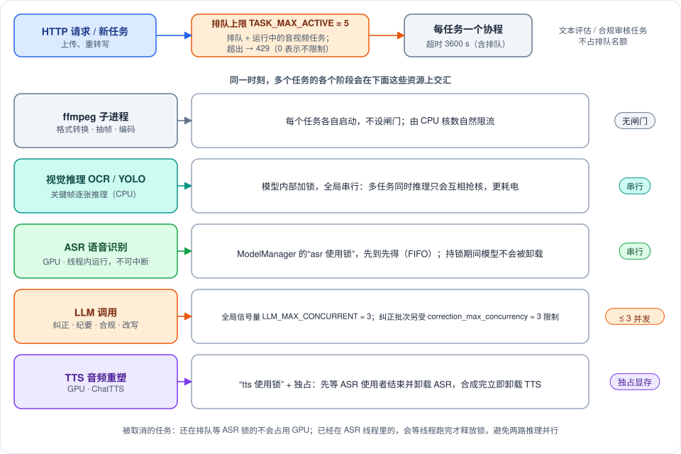
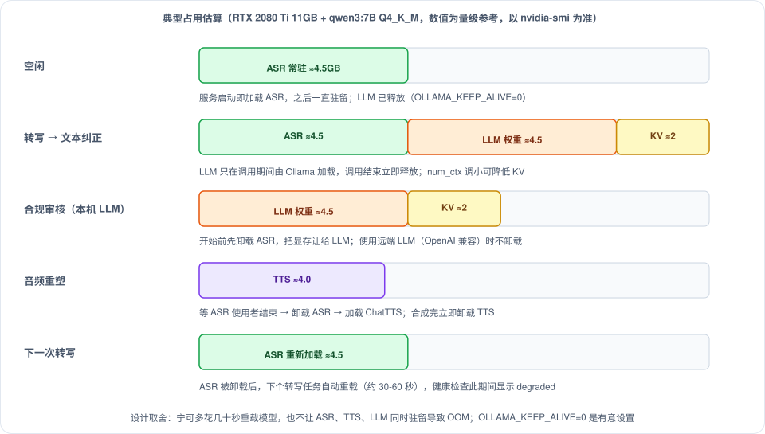

# 并发、容量与资源占用

> 作者: afu
>
> **一句话**：这套系统只有一块 GPU，ASR 一次只能处理一个任务，所以"同时提交"不等于"同时执行"。本文说明多个任务同时到来时资源怎么排队、显存怎么切换、单个任务的容量上限在哪，以及为降低耗电与空转所做的设计。
>
> **适合谁读**：运维、性能调优、做容量规划的人。本文由原《并发执行模型》与《压力极限》合并而成，并按重构后的代码更新。

> **关于数字**：吞吐与耗时表是开发机（RTX 5080 Laptop 16GB）上的**经验估算**，不是基准测试结果；显存数字是量级参考。部署后请用自己的文件压测一遍，再决定 `TASK_MAX_ACTIVE` 等参数。

---

## 一、一个任务会用到哪些资源

| 阶段 | 主要资源 | 是否有闸门 |
|---|---|---|
| 上传接收与落盘 | 磁盘 IO、网络 | 无（流式写盘，内存不随文件增长） |
| ffmpeg 转换 / 抽帧 | CPU、磁盘 | 无 |
| OCR / 人脸检测 | CPU | 全局串行（模型内部加锁） |
| ASR 识别 | GPU 显存与算力 | ASR 使用锁，串行 |
| 文本纠正 / 纪要 / 合规 | LLM | 全局并发 ≤ 3 |
| 音频重塑 | GPU 显存 | TTS 使用锁 + 独占显存 |

---

## 二、多个任务同时到来时

**排队上限。** 排队加运行中的音视频任务达到 `TASK_MAX_ACTIVE`（默认 5）时，新的提交直接返回 429，而不是让它排队到超时。文本评估与合规审核任务只占 LLM，不计入名额。分片上传在开始新会话时检查一次，末块到达时再检查一次。

**ASR 是最窄的瓶颈。** 所有任务共用一把"asr 使用锁"，先到先得。第 N 个任务在 ASR 阶段要多等大约 (N-1) 个单任务 ASR 耗时：

| 同时提交的音视频任务数 | 末尾任务额外等待（以单个 ASR 约 10 分钟计） | 判断 |
|---|---|---|
| 2 | 约 10 分钟 | 正常 |
| 3 | 约 20 分钟 | 可接受 |
| 4 | 约 30 分钟 | 后提交的体验下降 |
| 5 | 约 40 分钟 | 接近任务超时边界 |
| 6 及以上 | 50 分钟以上 | 可能触发 3600 秒超时（超时时间包含排队），所以默认在 5 处拦截 |

**不同任务的不同阶段可以重叠。** 第一个任务在做 LLM 纠正时，第二个任务可以同时做 ASR，它们用的是不同资源。最实用的并发度是 2–3 个任务：第一个做 ASR 时，第二个已经完成了 ffmpeg 转换，ASR 锁一释放立刻接上，GPU 几乎没有空档。

**LLM 吞吐不随任务数增加。** 全局信号量限制的是同时发出的请求数（默认 3），本机 Ollama 在 GPU 上本来就是串行推理，信号量主要用来隐藏网络与调度延迟。纠正、纪要、合规共享同一个预算；TTS 的口语改写用独立的客户端，不占这个预算。

**被取消或超时的任务。** ASR 在线程里运行，无法中断：
- 还在排队等 ASR 锁的任务被取消时，不会碰 GPU，直接退出；
- 已经在识别的任务被取消（超时、关停）时，协程会退出，但"持有锁"的部分继续运行到线程结束才释放锁，下一个任务不会与它并行占用 GPU。

因此界面上取消按钮在"语音识别中"不可用（返回 409），这是有意的。

---

## 三、显存

**核心约束：ASR、TTS 与本机 LLM 不能同时驻留。** 实现方式是 `ModelManager` 的"使用锁"：

- ASR 使用者持锁期间，模型不会被卸载；想卸载（合规审核前、音频重塑前）的一方要排队等它们结束；
- 音频重塑以"独占"方式使用 TTS：等 ASR 使用者结束 → 卸载 ASR → 加载 ChatTTS → 合成 → **立即卸载 TTS**。ASR 之后由下一个转写任务自动重载（约 30–60 秒，期间健康检查显示 `degraded`）；
- 本机 Ollama 的 `OLLAMA_KEEP_ALIVE=0` 让 LLM 每次调用后立即释放，避免它与 ASR 一起长期占显存。

**代价**：LLM 每批多 2–5 秒冷启动（模型重新加载）。如果显存宽裕，任务密集期可以设 `OLLAMA_KEEP_ALIVE=300`，让模型在任务间隙保持加载；需要先确认 ASR + LLM + KV 缓存加起来不超过显存。

`VRAM_BUDGET_GB` **只用于健康检查里显示"已用/预算"，不做强制约束**——互斥靠使用锁保证，不靠预算。

典型占用（qwen3:7B Q4_K_M，`OLLAMA_NUM_CTX_CORRECTION=4096`）：

| 组件 | 约占用 |
|---|---|
| CUDA / PyTorch 上下文 | 0.5 GB（常驻） |
| ASR 全栈（seaco_paraformer + VAD + 标点 + 说话人） | 4.0–4.5 GB |
| Ollama LLM 权重 | 4.5 GB 起（随模型规格浮动） |
| KV 缓存 | 约 2 GB（`num_ctx` 越大越多；OOM 时先调小它） |
| ChatTTS | 约 4 GB |

---

## 四、内存与磁盘

**内存**。重构前每个排队任务都会在内存里持有整个文件，峰值约为"排队任务数 × 文件大小"。现在：

- 表单上传边收边写盘，分片上传的数据文件直接移入任务目录，任务对象里只有路径；
- 流水线各阶段只传递文件路径；
- 内存里的任务对象只保存状态、进度与转写结果（数百 KB 量级），最多 `TASK_MAX_IN_MEMORY`（500）个。

**磁盘** 才是容量规划的主要对象：

| 内容 | 大小量级 | 保留 |
|---|---|---|
| 原始媒体 | 1 小时 MP4 约 300 MB；1 小时 WAV 约 600 MB | `MEDIA_RETENTION_HOURS`（24 小时）后删除 |
| 处理中的临时 WAV | 1 小时约 115 MB（16kHz 单声道） | ASR 结束即删 |
| 转写 / 纪要 / 合规 JSON | 每任务数十到数百 KB | 永久保留 |
| 关键帧 | 每张数十 KB，最多 500 张 | 永久保留（合规证据引用） |
| 音频重塑 MP3 | 约 1 分钟 1.5 MB | 与媒体同时删除 |

清理策略与目录布局见 `backend-architecture.md` 第十节；`MAX_STORAGE_GB` 可设配额，超限时从最旧的任务开始删除原始媒体。

---

## 五、各类任务的容量上限

下表的"安全上限"是在默认配置下、能在超时前稳定完成的量级。

| 项目 | 安全上限 | 代码/配置限制 | 主要瓶颈 |
|---|---|---|---|
| 单文件大小 | 取决于磁盘与上传时间 | `MAX_UPLOAD_SIZE_MB`，代码默认 500；`.env.prod` 与 Nginx 示例设为 15000 | 磁盘空间、上传耗时 |
| 单次音频时长 | 约 3 小时 | 代码硬限 10 小时 | 任务超时 3600 秒（含纠正与纪要） |
| ASR 并发 | 1 | 使用锁 | GPU |
| LLM 并发 | 3 路 | `LLM_MAX_CONCURRENT` | 本机 Ollama 吞吐 |
| 纪要 / 合规文本 | 50000 字 | 超出截断并在结果里标记 | 显存（KV 缓存） |
| 合规规则数量 | 约 50 条 | 单次提示词接近 `num_ctx`=8192 | 上下文窗口 |
| TTS 文本 | 无硬限 | 每次推理 ≤ 40 字（防幻读） | 输出文件大小 |
| 排队 + 运行中的音视频任务 | 5 | `TASK_MAX_ACTIVE`，超出 429 | ASR 串行与超时 |
| 内存任务数 | 500 | 最早结束的被淘汰，访问时从磁盘恢复 | 内存 |

**关于 `MAX_UPLOAD_SIZE_MB`。** 旧版本要求把它设小，是因为整个文件会读入内存；现在不再受内存限制，能传多大主要看磁盘与超时。但要注意：超过约 3 小时的音频无论如何都会撞上 3600 秒的任务超时，需要同时调大 `TASK_TIMEOUT_SECONDS`；同时要相应调大 Nginx 的 `client_max_body_size`（部署脚本生成的配置里上传接口为 15000m）。

### 单任务耗时估算（Paraformer + float16，RTX 5080）

| 音频时长 | ASR 推理 | 含纠正与纪要的全流程 | 是否在 1 小时超时内 |
|---|---|---|---|
| 30 分钟 | 约 4–6 分钟 | 约 8–12 分钟 | 是 |
| 1 小时 | 约 8–12 分钟 | 约 15–25 分钟 | 是 |
| 2 小时 | 约 16–24 分钟 | 约 30–50 分钟 | 是 |
| 3 小时 | 约 25–40 分钟 | 约 45–70 分钟 | 接近边界 |
| 4 小时 | 约 35–55 分钟 | 约 60–90 分钟 | 可能超时 |

### 后续阶段的估算

| 阶段 | 规模 | 估算耗时 |
|---|---|---|
| LLM 纠正（qwen3:8B，约 30 tokens/s） | 1 万字 | 约 2–3 分钟 |
| | 3 万字 | 约 5–9 分钟 |
| 纪要（Map-Reduce） | 6000 字内直接评估 | 20–40 秒 |
| | 5 万字（上限） | 约 90–150 秒 |
| 合规审核 | 2 万字 | 约 60–90 秒 |
| | 5 万字（上限） | 约 120–200 秒 |
| 音频重塑（ChatTTS） | 1.5 万字（约 1 小时转写） | 约 2–3 分钟，输出约 45–60 分钟音频 |

---

## 六、为效率与省电做的设计

这部分是本次审计后集中做的优化，按"减少无谓的唤醒、重复计算与常驻占用"的思路整理。

| 位置 | 措施 | 效果 |
|---|---|---|
| 前端轮询 | 标签页在后台时从 2 秒降到 10 秒；上一次请求结束后才计划下一次；健康页有独立的短超时 | 少唤醒网络与 CPU，请求不堆积 |
| 前端轮询 | 离开任务或回到首页时中止在途轮询与摘要/合规请求 | 旧任务不再空转 |
| 播放同步 | 只在播放期间用逐帧回调；暂停时零开销；进度写入频率降到约 10 次/秒 | 暂停时无空转，重渲染大幅减少 |
| 转写列表 | 只让"当前句/当前块"订阅播放时间（布尔条件），自动滚动改为瞬时订阅，列表项 memo | 播放时不再整屏重渲染 |
| 波形 | 超过 200MB 的文件不再整文件下载解码，只保留进度条 | 避免大文件占满内存与长时间占用 CPU |
| 后端线程数 | `OMP_NUM_THREADS` 等改为"未设置时才使用全部核数"，可在 systemd 或环境里下调 | 多核机器上避免 OpenMP 线程空转自旋 |
| 视觉推理 | OCR 与 YOLO 串行执行 | 多个视频任务不再互相抢核 |
| 模型常驻 | TTS 用完立即卸载；ASR 仅在必要时卸载；远端 LLM 时合规审核不再卸载 ASR | 少占显存，少无谓重载 |
| 清理与扫描 | 后台清理每小时一次，一次扫描共用；历史列表放入工作线程 | 无空转轮询，不阻塞事件循环 |
| 日志 | 生产单元关闭 uvicorn access log | 避免每 2 秒一条的写入 |
| 崩溃重启 | systemd 限制重启频率（5 分钟内最多 5 次） | 模型缺失等致命错误不会反复加载模型空耗 |
| 静态资源 | Nginx 对带哈希的资源缓存一年，入口页面不缓存 | 少重复请求 |
| MacBERT / 热词 | 移出事件循环；MacBERT 只在首次使用时加载 | 批量转写期间接口不再卡顿 |

---

## 七、调优参数速查

| 参数 | 默认 | 想要…时调整 | 影响 |
|---|---|---|---|
| `TASK_MAX_ACTIVE` | 5 | 更早拒绝 / 允许更长队列 | 调大会让末尾任务更容易超时 |
| `TASK_TIMEOUT_SECONDS` | 3600 | 处理超过 3 小时的音频 | 也影响排队多久会被判超时 |
| `LLM_MAX_CONCURRENT` | 3 | 远端 LLM 吞吐更高时调大 | 本机 Ollama 调大没有收益 |
| `OLLAMA_KEEP_ALIVE` | 0 | 显存宽裕、任务密集时设 300 | 省去每批 2–5 秒冷启动，但 LLM 常驻 4–8GB |
| `OLLAMA_NUM_CTX_CORRECTION` | 4096 | 显存吃紧时调小 | KV 缓存更小 |
| `ASR_BATCH_SIZE` | 3000 | 显存小时调小（`.env.prod` 为 11GB 机器设了 20） | 过大易 OOM；启用说话人分离时内部另有 60 秒的上限 |
| `MEDIA_RETENTION_HOURS` | 24 | 磁盘紧张调小 | 过期后无法重转写 |
| `MAX_STORAGE_GB` | 0 | 给上传目录设配额 | 超限从最旧任务删媒体 |
| `FACE_DETECT_ENABLED` | true | 不需要人脸事件时关闭 | 省视频任务的 CPU（事件目前不参与合规判定） |
| `OMP_NUM_THREADS`（环境变量） | 全部核数 | 多核机器上并发任务较多时下调 | 减少 CPU 争用 |

---

## 八、已知限制

- ASR 不可中断，也不能批处理多个音频；提高 ASR 吞吐需要改调度层，成本较高。
- 排队等 ASR 的任务在界面上显示为"语音识别中"（没有单独的"排队等 GPU"状态）。
- 合规审核在使用本机 LLM 时会卸载 ASR；与转写任务交替提交会造成 ASR 反复卸载与重载（每次数十秒），建议把两类任务在时间上错开。
- `OLLAMA_KEEP_ALIVE=0` 与吞吐之间是有意的取舍，见上文。
- 关键帧先全部抽出再抽样，长视频会短暂占用较多磁盘。
