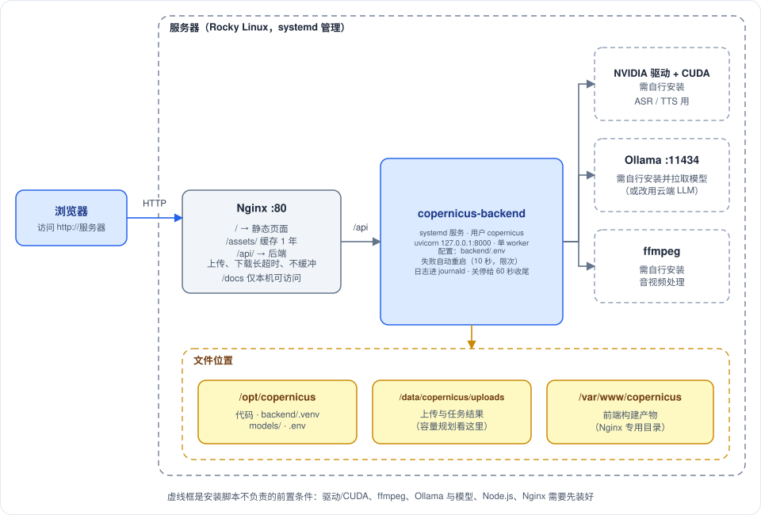
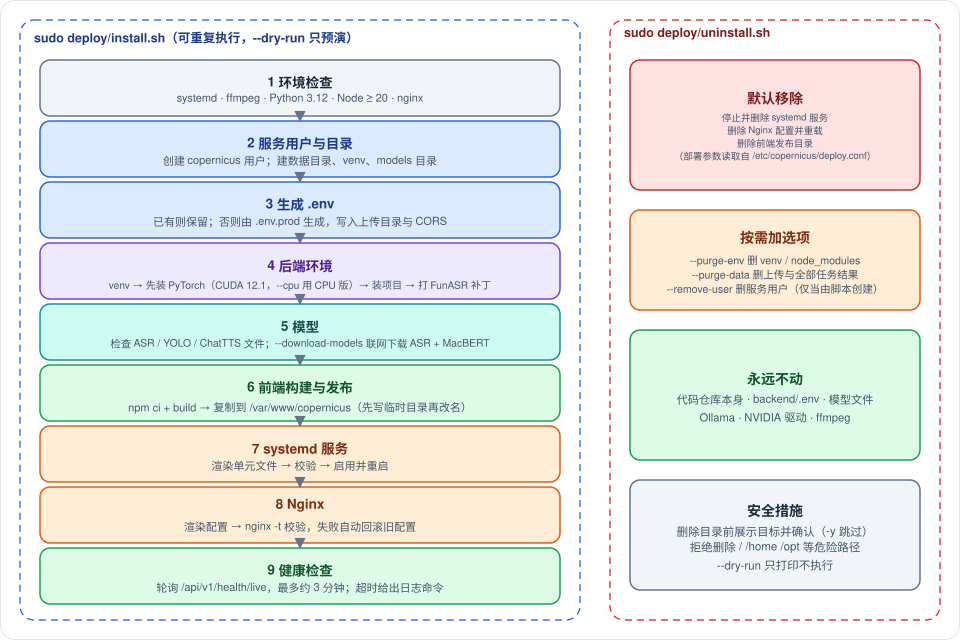

# Copernicus 部署指南

> 作者: afu
>
> **一句话**：仓库自带 `deploy/install.sh` 与 `deploy/uninstall.sh`。装好显卡驱动、ffmpeg、Node.js、Nginx 和 Ollama 之后，一条命令就能完成"建用户 → 装依赖 → 构建前端 → 注册 systemd 服务 → 配置 Nginx → 健康检查"，并且可以重复执行、随时卸载。
>
> **适合谁读**：第一次把 Copernicus 部署到 Linux 服务器的运维人员。脚本的目标环境是 Rocky Linux 10 + NVIDIA GPU，其他使用 systemd 的发行版通常也能用，但**只在开发机上做过语法检查与 dry-run，没有在 Rocky Linux 生产机上完整跑过**，首次部署请先用 `--dry-run` 预演并留意每一步输出。

---

## 一、部署后是什么样

- 浏览器只访问 Nginx 的 80 端口：静态页面由 Nginx 直接提供，`/api/` 反向代理到本机回环地址的后端（外部无法直连 8000 端口）。
- 后端是一个 systemd 服务，运行在专用低权限用户下，只有一个 worker（原因见 `backend-architecture.md`）。
- 数据、代码、前端产物分放三处，方便备份与升级：

| 位置 | 内容 | 备份/容量 |
|---|---|---|
| 代码目录（就是你克隆仓库的位置，**建议 `/opt/copernicus`**：服务用户必须能进入该路径，放在某个用户 700 权限的 home 下会失败） | 后端代码、`backend/.venv`、`backend/models/`、`backend/.env` | 模型体积大，`.env` 要备份 |
| `/data/copernicus/uploads` | 上传的媒体与所有任务结果 | **容量规划看这里**，需要备份 |
| `/var/www/copernicus` | 前端构建产物（Nginx 专用） | 可随时重新生成 |
| `/etc/copernicus/deploy.conf` | 安装参数记录（卸载时读取） | 无需备份 |

---

## 二、安装前需要准备

脚本**不会**安装下面这些系统级组件（它们与机器、网络、许可强相关，请按你的环境准备）：

| 前置条件 | 要求 | 检查方式 |
|---|---|---|
| 操作系统 | 使用 systemd 的 Linux（目标为 Rocky Linux 10） | `systemctl --version` |
| NVIDIA 驱动 + CUDA 运行库 | ASR 与 TTS 使用 GPU；没有 GPU 可以用 `--cpu`，但速度会慢很多 | `nvidia-smi` |
| ffmpeg | 音视频转换、抽帧、MP3 编码 | `ffmpeg -version` |
| Python 3.12 | 推荐用 pyenv 装在**服务用户可访问**的位置 | `python3.12 --version` |
| Node.js ≥ 20 与 npm | 构建前端（用 `--skip-frontend` 可跳过） | `node -v` |
| Nginx | 反向代理（用 `--no-nginx` 可跳过） | `nginx -v` |
| Ollama 与 LLM 模型 | 本机大模型（也可改用 OpenAI 兼容的云端接口，在 `.env` 里配置 `LLM_PROVIDER`） | `ollama list` |
| 模型文件 | ASR、人脸检测、ChatTTS 的权重，见第四节 | — |

**资源建议**：显存 ≥ 11GB（ASR 约 4.5GB + 本机 LLM 约 6.5GB）；内存不需要按文件大小预留（上传全程不入内存）；磁盘按"同时保留的任务数 × 媒体大小"估算，见 `concurrency-capacity.md`。

---

## 三、一键安装

在**仓库根目录**以 root（或 sudo）执行 `deploy/install.sh`。建议第一次先加上 `--dry-run`，它只打印每一步会做什么，不做任何改动。

### 常用选项

| 选项 | 说明 | 默认 |
|---|---|---|
| `--dry-run` | 只预演，不做任何改动 | 关 |
| `--user 名称` | 服务运行用户，不存在则创建（系统用户，无登录 shell） | copernicus |
| `--data-dir 目录` | 数据目录，上传放在其下的 `uploads/` | /data/copernicus |
| `--web-root 目录` | 前端发布目录 | /var/www/copernicus |
| `--server-name 名称` | Nginx 的 `server_name`；指定后 `.env` 里的 CORS 也会写成该地址 | `_`（匹配任意） |
| `--port 端口` | 后端监听端口（仅本机回环） | 8000 |
| `--python 路径` | 指定 Python 3.12 解释器 | 自动查找 |
| `--cpu` / `--torch-index 地址` | 安装 CPU 版 PyTorch / 指定 PyTorch 下载源（默认 CUDA 12.1 版） | CUDA 12.1 |
| `--download-models` | 联网预下载 ASR 与文本纠错模型 | 关 |
| `--skip-frontend` / `--no-nginx` / `--no-start` | 跳过前端构建 / Nginx 配置 / 启动服务 | 关 |
| `--open-firewall` | 用 firewalld 放行 http 服务 | 关 |
| `-y` | 不询问确认 | 关 |

### 它做了什么（按顺序）

1. **环境检查**：systemd、ffmpeg、Python 3.12、Node ≥ 20、nginx 是否可用；没有 nvidia-smi 时提示用 `--cpu`。
2. **服务用户与目录**：创建用户、数据目录、`backend/.venv`、`backend/models`，并把它们的属主设为服务用户。
3. **生成 `.env`**：`backend/.env` 已存在则**原样保留**；否则由 `.env.prod`（RTX 2080 Ti 11GB 的生产取值）生成，并写入上传目录与 CORS 设置，权限 640。
4. **后端环境**：以服务用户创建虚拟环境；**先**从指定源安装 PyTorch，再安装项目依赖（顺序不能反，否则依赖解析可能换成别的 CUDA 版本）；最后打 FunASR 补丁。
5. **模型**：检查 ASR / 人脸检测 / ChatTTS 文件，缺失只警告；加了 `--download-models` 才联网下载。
6. **前端构建与发布**：`npm ci` 严格按锁文件安装，构建后复制到发布目录（先写临时目录再改名，切换瞬间完成，访问者不会看到半成品）。
7. **systemd 服务**：由模板渲染单元文件，用 `systemd-analyze` 校验，启用并（除非 `--no-start`）重启。
8. **Nginx**：渲染配置后先 `nginx -t` 校验，**校验失败会自动恢复旧配置**并停止，不会把线上 Nginx 弄坏。
9. **健康检查**：轮询存活探针，最多约 3 分钟（加载 ASR 模型需要 30–60 秒）；超时会打印查看日志的命令。

**可重复执行**：重复运行会跳过已存在的用户、虚拟环境与 `.env`，已装的 PyTorch 不会重装；这是升级的标准方式（见第六节）。

### systemd 单元与 Nginx 配置的要点

配置模板在 `deploy/templates/`，由脚本填入路径、用户与端口。相对手写配置，模板做了这些处理：

| 项目 | 做法 | 原因 |
|---|---|---|
| 应用配置 | 单元里**不使用** `EnvironmentFile`，由程序直接读 `backend/.env` | systemd 不能解析行内 `#` 注释，旧做法要先用脚本剥注释，容易出错 |
| 崩溃重启 | 失败 10 秒后重启，5 分钟内最多 5 次 | 模型缺失等致命错误不要反复加载模型空耗 |
| 关停 | 给 60 秒收尾 | 后端会取消并保存进行中的任务 |
| 日志 | 进 journald；关闭 uvicorn 的 access log | 前端每 2 秒轮询一次，逐条记录只增加写入 |
| 权限 | `NoNewPrivileges`、`PrivateTmp`、`ProtectSystem=full` | 最小权限 |
| Nginx 代理头 | 写在 server 层，各 location 继承 | 避免每个 location 重复六行 |
| 静态资源 | `/assets/` 缓存一年；入口页面不缓存 | 带内容哈希的文件永不变，减少重复请求 |
| 上传/下载接口 | 关闭请求缓冲、超时 3600 秒 | 大文件流式转发，不占 Nginx 内存 |
| `/docs`、`/redoc` | 仅本机可访问 | 不向公网暴露接口文档 |

---

## 四、模型准备

| 模型 | 位置 | 怎么获得 |
|---|---|---|
| ASR 全套（识别 / VAD / 标点 / 说话人） | `backend/models/funasr/` | `--download-models`（联网，从 ModelScope 下载，只下载不加载，不占显存），或从开发机整体拷贝 `models/funasr/models/iic/` |
| 文本纠错 MacBERT | 服务用户的 HuggingFace 缓存（`~/.cache/huggingface`，即 `/var/lib/copernicus/...`） | 同样由 `--download-models` 下载；**必须在联网时缓存好**，因为服务单元设置了 `HF_HUB_OFFLINE=1` |
| 人脸检测 YOLO | `backend/models/yolo/yolov8n-face.pt` | 手动放置（视频视觉扫描需要） |
| ChatTTS | `backend/models/chattts/`（含 `asset`、`gpt`、`tokenizer` 与四个 safetensors 文件） | 手动放置（音频重塑需要） |
| LLM | Ollama 自己的模型目录 | 在 Ollama 里拉取 `.env` 中 `LLM_MODEL_NAME` 指定的模型 |

**离线环境**：先在联网机器上准备好以上文件，再拷贝到服务器对应位置；`backend/scripts/download_models.py` 可以在无 GPU 的联网机器上单独运行。缺少任何一项都不会阻止服务启动，但对应功能不可用，日志里的"启动预检"段落会列出缺什么。

---

## 五、配置

配置文件是 `backend/.env`（首次安装由 `.env.prod` 生成，之后**不会被脚本覆盖**）。改完后重启服务生效：重启命令是 `systemctl restart copernicus-backend`。

生产机器（RTX 2080 Ti 11GB）的取值与原因：

| 配置 | 生产值 | 原因 |
|---|---|---|
| `OLLAMA_NUM_CTX` / `OLLAMA_NUM_CTX_CORRECTION` | 16384 / 4096 | 11GB 显存装不下大窗口 |
| `OLLAMA_KEEP_ALIVE` | 0 | LLM 用完立即释放，避免与 ASR 同时驻留 OOM |
| `ASR_BATCH_SIZE` / `ASR_DTYPE` | 20 / float16 | 11GB 显存的保守值 |
| `LLM_TIMEOUT` / `LLM_MAX_CONCURRENT` | 180 / 3 | 本机 LLM 较慢，超时放宽；并发 3 |
| `MAX_UPLOAD_SIZE_MB` | 15000 | 需与 Nginx 的 `client_max_body_size` 一致 |
| `TTS_REWRITE_ENABLED` | false | 口语改写要再调用 LLM，显存紧张时关闭 |
| `CORS_ORIGINS` | 由 `--server-name` 生成 | 经 Nginx 同源访问时其实不需要跨域 |

**键名必须正确**：`.env` 里出现程序不认识的键会导致启动报错（而不是被忽略），升级时对照 `backend/.env.example`。

**使用云端 LLM**：把 `LLM_PROVIDER` 设为 `openai`，并配置 `LLM_BASE_URL`、`LLM_MODEL_NAME`、`LLM_API_KEY`；此时合规审核不再卸载 ASR。

---

## 六、日常运维

| 场景 | 做法 |
|---|---|
| 查看状态与日志 | `systemctl status copernicus-backend`；`journalctl -u copernicus-backend -f`（日志每行带 request_id，可按它检索一次请求的全部日志） |
| 健康检查 | `curl http://127.0.0.1:8000/api/v1/health/live`（进程存活）；`…/health`（各组件状态、任务统计、显存）；或浏览器打开 `/health` 页面 |
| 监控指标 | `curl http://127.0.0.1:8000/metrics`（Prometheus 文本格式）。Nginx 不转发该路径，抓取器需与后端在同一台机器，或自行在网关上加访问控制后转发 |
| 升级代码 | 拉取新代码后**再次运行 `deploy/install.sh`**（重复执行是安全的：会更新依赖、重打 FunASR 补丁、重新构建前端并重启） |
| 升级 FunASR 后 | 必须重打补丁（`install.sh` 会做；单独做用 `backend/scripts/patch_funasr.py`），否则置信度过滤失效，耗时可增加数十倍 |
| 更新纪要模板 | 修改 `backend/templates/` 后调用 `POST /api/v1/templates/reload`，不用重启 |
| 备份 | `/data/copernicus/uploads` 与 `backend/.env` |
| 磁盘占满 | 调小 `MEDIA_RETENTION_HOURS`，或设置 `MAX_STORAGE_GB`；原始媒体过期后不能重转写，结果 JSON 与关键帧保留 |
| 打包分发 | `python backend/scripts/build_package.py`（`--no-models` 不带模型体积） |

---

## 七、卸载

执行 `deploy/uninstall.sh`（同样支持 `--dry-run`）。**默认只移除系统级配置**：停止并删除 systemd 服务、删除 Nginx 配置并重载、删除前端发布目录。数据与代码需要显式选项才会删除：

| 选项 | 效果 |
|---|---|
| `--purge-env` | 删除虚拟环境与前端 `node_modules`（可重新安装） |
| `--purge-data` | 删除数据目录（上传与全部任务结果，**不可恢复**） |
| `--remove-user` | 删除服务用户（仅当该用户由安装脚本创建） |
| `-y` | 不询问确认 |

**永远不会动**：代码仓库本身、`backend/.env`、模型文件、Ollama、NVIDIA 驱动、ffmpeg。删除目录前会展示目标并要求确认，并拒绝 `/`、`/home`、`/opt` 等危险路径。安装参数从 `/etc/copernicus/deploy.conf` 读取，因此卸载时不必重复指定用户与目录。

---

## 八、常见问题

| 现象 | 可能原因 | 处理 |
|---|---|---|
| 页面能开但 `/api` 返回 502 | 后端没起来或还在加载模型 | 看 `journalctl -u copernicus-backend`；等 1 分钟；确认 `.env` 没有多余或拼错的键 |
| 页面 403 或空白 | SELinux 处于 Enforcing，Nginx 读不到发布目录 | 脚本已尝试 `restorecon`；仍不行请检查审计日志，或按需配置 SELinux 策略 |
| 启动预检提示 ASR 模型缺失 | 没有下载模型 | 用 `--download-models` 重跑，或拷贝模型目录 |
| 转写很慢、日志里几乎所有句段都送 LLM | FunASR 补丁丢失（升级过 funasr） | 重跑 `install.sh` 或 `patch_funasr.py` |
| 显存 OOM | `num_ctx` 太大、ASR 批太大 | 调小 `OLLAMA_NUM_CTX*`、`ASR_BATCH_SIZE`；保持 `OLLAMA_KEEP_ALIVE=0` |
| 上传大文件失败 | Nginx 或 `.env` 的大小上限不一致 | 同时检查 `MAX_UPLOAD_SIZE_MB` 与 Nginx 的 `client_max_body_size` |
| 纠错没有生效（离线环境） | MacBERT 没有预先缓存，而服务是离线模式 | 联网时用 `--download-models` 缓存到服务用户的 HuggingFace 目录 |
| `install.sh` 报服务用户无法执行 Python | pyenv 装在别的用户 home 下，权限不足 | 用 `--python` 指定服务用户可访问的解释器 |
| 提示 429 | 排队 + 处理中的任务已达上限 | 稍后重试，或评估后调大 `TASK_MAX_ACTIVE` |

**手工部署**：如果不想用脚本，模板文件 `deploy/templates/copernicus-backend.service.in` 与 `copernicus.nginx.conf.in` 里的 `@变量@` 占位符就是需要替换的全部内容（应用目录、服务用户、端口、发布目录、`server_name`），按上面各节的顺序手工完成同样的步骤即可。
