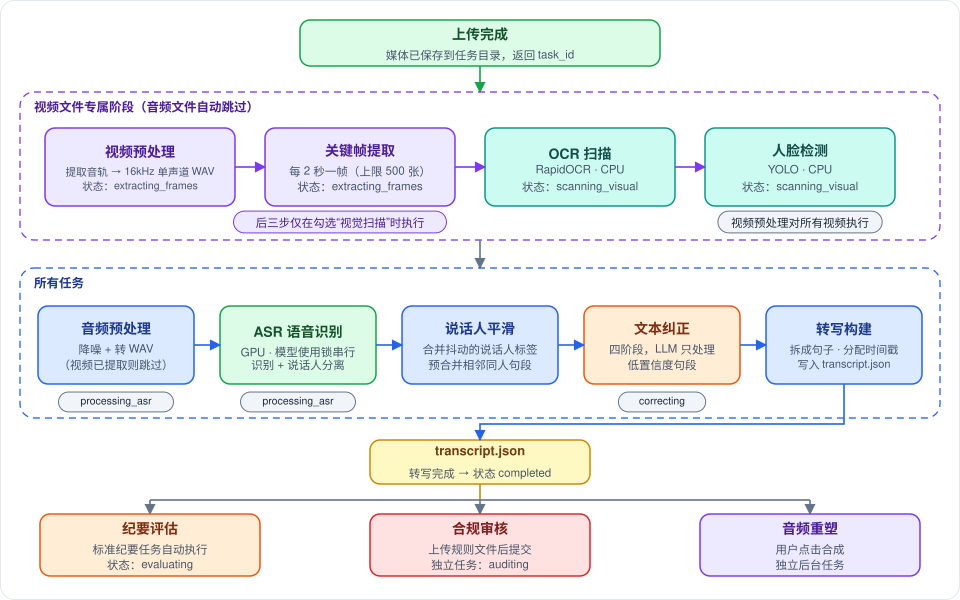
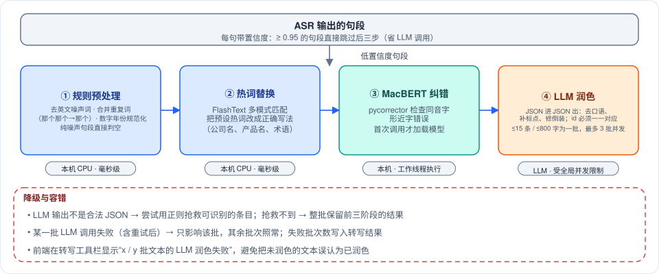
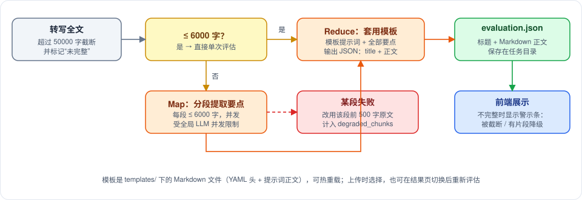
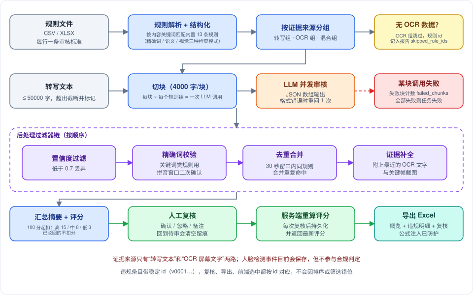

# Copernicus 功能介绍

> 作者: afu
>
> **一句话**：Copernicus 是一个音视频"听写 + 审核"工作台——上传一段会议或产品说明会的录音/录像，它会自动转成带说话人和时间戳的文字，整理成会议纪要，并可按你给的规则做合规审核，还能把文字重新合成为多人对话音频。
>
> **适合谁读**：想了解"这个系统能做什么、每一步发生了什么、结果怎么用"的人（使用者、产品、测试、新入职的开发）。实现细节请读 `backend-architecture.md` 与 `frontend-architecture.md`。

---

## 一、能做什么

| 能力 | 用户看到的结果 | 需要什么 |
|---|---|---|
| 语音转写 | 按说话人分段、带时间戳、可点击跳转播放的文字稿 | 一段音频或视频 |
| 文本纠正 | 去掉口语赘词、修正同音错别字与专有名词、补标点 | 自动完成 |
| 会议纪要 | 标题 + 按模板排版的纪要（5 种模板可选） | 自动完成，可换模板重新生成 |
| 视觉扫描（仅视频） | 抽取关键帧，识别画面文字（OCR）与人脸出现/缺失 | 上传视频时勾选 |
| 合规审核 | 按你的规则逐条检查，标出违规位置、原因、证据与严重度，给出合规评分 | 一份 CSV / XLSX 规则文件 |
| 人工复核 | 逐条确认或忽略违规、加备注，评分随之更新，可导出 Excel | 在审核结果里操作 |
| 转写校对 | 直接改错字、重命名/合并说话人，改动保存到服务器并进入导出 | 在转写视图里操作 |
| 音频重塑 | 把转写稿合成为多说话人的对话 MP3（每个说话人一种音色） | 一键触发 |
| 历史任务 | 首页列出所有任务，可重命名、彻底删除，服务重启后仍在 | 自动保存 |

**它不做什么**：不做实时转写；没有用户与权限体系（请放在内网或网关之后）；合规审核只有转写文本和画面文字两路证据，人脸检测结果目前只保存、不参与判定；纪要是自由文本，没有"行动项/责任人"这类结构化字段。

---

## 二、一次完整使用的流程

1. **上传**：拖拽或选择文件。小文件直接上传，大文件自动切成 5MB 一块，可断点续传；文件内容相同的（SHA-256 一致）不会重复处理，直接打开已有结果。
2. **处理**：后台按流水线依次处理（下一节），页面显示进度。
3. **查看与校对**：三栏工作区里播放媒体、查看转写、修改文本、看纪要。
4. **审核（可选）**：上传规则文件，得到违规列表，逐条复核。
5. **导出**：转写导出 SRT 字幕、Word、PDF；合规报告导出 Excel；对话音频下载 MP3。

---

## 三、处理流水线

视频比音频多几步，但**转写的核心链路一样**：转成 16kHz 单声道音频 → 语音识别 → 整理说话人 → 文本纠正 → 生成转写。

| 阶段 | 通俗解释 |
|---|---|
| 视频预处理 | 从视频里取出声音（同时做降噪与音量归一化） |
| 关键帧提取 | 每隔约 2 秒截一张图（最多 500 张），后面 OCR 和人脸检测要用 |
| OCR 扫描 | 识别画面里出现的文字（如课件上的承诺性字样），只用 CPU |
| 人脸检测 | 判断画面里有没有人脸，记录"出现/缺失"的时间段，只用 CPU |
| 音频预处理 | 把任何格式转成语音识别需要的标准格式 |
| 语音识别 | GPU 上的模型把声音变成文字，同时分辨"谁在说话"，一次只处理一个任务 |
| 说话人平滑 | 修正识别里偶尔跳动的说话人标签，把相邻同一个人的短句并在一起 |
| 文本纠正 | 见下一节 |
| 转写构建 | 拆成一句一句、分配时间戳，剔除空内容，保存结果 |

**视觉扫描是可选的**：上传视频时会问"是否同时进行视觉扫描"。只想要转写就跳过它，处理更快；要做合规审核，且规则里有"画面必须出现某某文字"这类要求，才需要开。

**进度条**：抽帧约 0–5%，视觉扫描 5–20%，语音识别固定 20%，文本纠正按批次从 20% 走到 90%，生成纪要 90–100%。音频任务直接从 20% 起步。

### 转写模式

| 模式 | 适合 | 特点 |
|---|---|---|
| Paraformer（默认） | 多人对话 | 一次推理同时输出文字、标点、说话人，支持热词 |
| SenseVoice | 嘈杂环境 | 抗噪更好，说话人通过声纹聚类单独分离 |

### 文本纠正：四步

只有第四步用到大模型，并且只处理"识别把握不高"的句段，所以既省时间也省算力。**如果大模型不可用或某批调用失败**，这些内容会保留识别原文，转写工具栏会显示"x / y 批文本的 LLM 润色失败"，不会悄悄把未润色的文本当成已润色。

---

## 四、会议纪要

- **5 种模板**：通用（默认）、夕会、周例会、公文、简报摘要。模板是 `templates/` 目录下的 Markdown 文件，改完可以热重载，不用重启。
- **上传时选择模板**，也可以在结果页换模板后点"重新评估"。
- **长文本**：先分段提炼要点，再合并成纪要，这样几万字的会议也不会撑爆模型。超过 5 万字的部分会被截断，并在结果上标出"未完整"。
- **纪要生成失败不影响转写**：转写结果照常可用，打开任务时会自动重试生成纪要。

---

## 五、合规审核

**你提供**：一份规则文件（CSV 或 XLSX，一行一条审核标准，可附历史违规案例作为示例）。

**系统做的**：
1. 把你的规则与内置的 13 条产说会合规规则匹配（如禁用词、必须告知的事项、必须展示的画面），得到"怎么检查、看什么证据"；
2. 把转写文本切块，每一块对每一组规则各调用一次大模型，逐条推理；
3. 用规则化的检查纠正模型的误报与漏报（例如关键词类规则用拼音匹配兜住同音字识别错误）；
4. 合并、去重，生成总结与评分（100 分起扣：高风险 15、中风险 8、低风险 3）。

**结果里的每条违规**包含：时间点、说话人、原文、违反了哪条规则、判定理由与完整推理、严重度、置信度、证据（语音原文或 OCR 文字与关键帧截图）、当前状态（待审 / 已确认 / 已忽略）。

**结果的完整性会被明确告知**（避免"没查到"被误读成"没问题"）：

| 情况 | 提示 |
|---|---|
| 文本超过 5 万字 | 显示"仅检查了前 x / y 段" |
| 部分分块的模型调用失败 | 显示"x / y 个分块被跳过，可能漏检" |
| 没有 OCR 数据（如纯音频任务） | 显示"n 条依赖画面文字的规则未被审核"，并列出规则编号 |

**人工复核**：确认、忽略或改回待审，可写备注；每次复核后评分立即重算（被忽略的条目不再扣分），并记录复核时间。改动先在界面上立即生效，后台合并保存；即使网络暂时失败也会自动重试，关闭页面前会尽力提交。

**导出**：Excel 含概览与违规明细（带复核状态、时间与备注）。

---

## 六、音频重塑

把转写稿变成多人对话音频：

1. 相邻的同一说话人段落合并后一起合成，语调更自然；
2. 每个说话人分配一种固定音色（可以自定义），同一个人每次听起来一样；
3. 可选：先让大模型把书面语改写成口语（默认关闭）；
4. 分批合成、拼接成 MP3，页面内可直接播放与下载；
5. 合成期间 ASR 会被临时卸载以腾出显存，结束后立即释放；下一个转写任务会自动重新加载 ASR（约 30–60 秒）。

同一个任务合成进行中再次提交会被拒绝（409）；有正在使用大模型的任务时也会被拒绝（503），稍后重试即可。

---

## 七、工作区界面

三栏布局：

| 区域 | 内容 |
|---|---|
| 左栏 | 播放器（视频，或音频 + 波形）、智能摘要、合规审核、音频重塑（可折叠） |
| 中栏 | 标签页：转写结果（工具栏 + 虚拟滚动的对话气泡）/ 违规报告（统计、筛选、卡片列表） |
| 右栏（按需） | 违规证据详情：完整证据、截图缩放、前后转写上下文 |

**转写视图**：气泡按说话人左右交替；播放时当前句高亮并自动滚动；点击任一句跳转到对应位置；双击可校对修正文（Enter / 失焦保存，Esc 取消）；可切换"原文 / 修正文"、按说话人显隐、全文搜索；说话人可重命名，改成同一名字即合并；支持重新转写（会清除旧的纪要与合规结果）。

**违规审核**：可按严重度、来源、状态筛选，也可全文搜索；点击时间戳会跳到对应位置并循环播放该片段。

| 快捷键 | 功能 |
|---|---|
| Space | 播放 / 暂停 |
| Enter | 确认当前违规 |
| Delete / Backspace | 忽略当前违规 |
| ↑ / ↓ | 上一条 / 下一条 |
| B | 开关批量模式 |
| Ctrl+A | 批量模式下全选 |
| Esc | 关闭证据面板或退出批量模式 |

快捷键不会抢按钮的 Enter/Space，也尊重带 Ctrl / Cmd / Alt 的浏览器组合键。

**其他页面**：首页（上传 + 历史任务，回到首页会清除上一个任务的界面状态并停止它的后台请求）；服务状态页 `/health`（ASR / LLM / TTS、任务统计、显存水位，每 10 秒刷新一次）；右上角可切换深色主题，刷新后保持。

---

## 八、系统保护与容错

| 机制 | 作用 |
|---|---|
| 排队上限 | 同时排队 + 处理的音视频任务最多 5 个，再提交返回 429，避免排到超时 |
| 任务超时 | 单个任务最多 1 小时（含排队时间） |
| 取消 | 排队、文本纠正、生成纪要、合规审核阶段可取消；语音识别与视觉扫描阶段不可取消 |
| 重启恢复 | 有结果的任务恢复为已完成；被打断的任务恢复为失败，可重新转写 |
| 去重 | 同一文件不重复处理；失败的任务不参与复用 |
| 自动清理 | 原始媒体默认 24 小时后删除（转写/纪要/合规结果与关键帧保留）；失败任务、上传残留、超配额的媒体也会被清理 |
| 大模型容错 | 自动重试（指数退避）、输出格式错误时降级抢救、失败批次只影响自己并被标记 |
| 显存保护 | ASR 与 TTS 不同时驻留；本机大模型每次调用后立即释放 |
| 原子写入 | 结果文件先写临时文件再改名，进程崩溃不会留下损坏的文件 |
| 请求追踪 | 每个请求有 request_id，出现在响应头、错误响应和相关日志里 |
| 健康检查 | 存活探针与就绪探针分开，就绪探针给出各组件状态 |

接口清单与调用方法见 `third-party-integration.md`；容量与并发见 `concurrency-capacity.md`。
