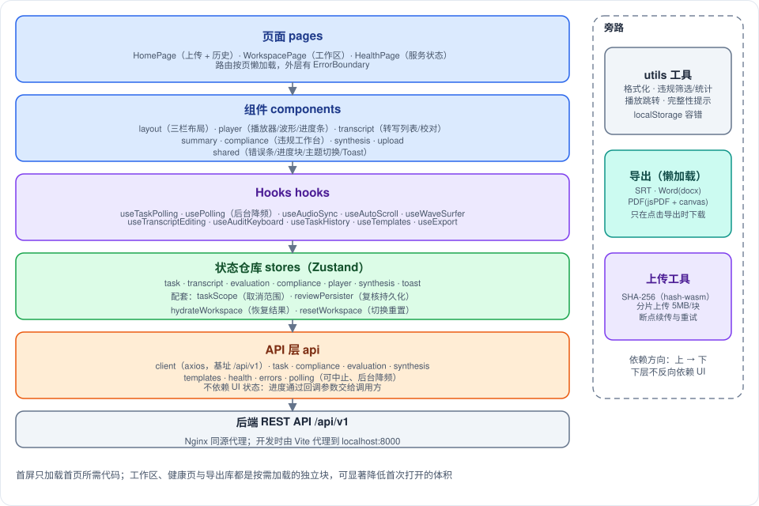
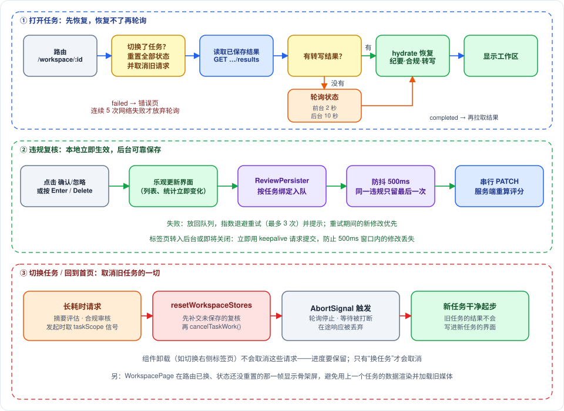

# Copernicus 前端架构文档

> 作者: afu
>
> **摘要**：本文说明 Copernicus 前端（`frontend/src`）如何组织、状态如何流转、为什么这样设计，内容以 2026-09 重构之后的代码为准。
>
> **阅读对象**：第一次接触这个前端的开发者。先读第一到第六节即可建立整体印象，后面的章节按需查阅。

---

## 一、它是什么

前端是一个单页应用（SPA，浏览器只加载一次页面，之后由脚本切换视图），用来完成四件事：上传音视频、查看和校对转写结果、查看纪要、复核合规审核发现的违规项。它不做任何识别或推理，所有重活都在后端完成，前端负责上传、展示、人工修正和把修正保存回去。

生产环境中，浏览器从 Nginx 取静态页面，接口请求经 Nginx 反向代理到后端；开发时由 Vite 开发服务器（端口 3000）把 `/api` 代理到本机 8000 端口。

图中最左侧的“浏览器 / React 前端”就是本文的范围。前端只通过 `/api/v1` 下的 REST 接口与后端通信，不直接接触模型、磁盘或 ffmpeg。

### 1.1 技术栈

| 层级 | 选型 | 说明 |
|------|------|------|
| 框架与语言 | React 19、TypeScript 5.9 | 严格模式，开启未使用变量检查 |
| 构建 | Vite 7 | `npm run build` 先做 `tsc -b` 类型检查再打包 |
| 路由 | react-router-dom 7 | 三个页面，按路由懒加载 |
| 状态管理 | Zustand 5 | 七个独立 store，不需要 Provider |
| 样式 | Tailwind CSS 4 + DaisyUI 5 | 两套主题：corporate（默认）与 dark |
| 长列表 | react-virtuoso | 只渲染可视区域内的转写块 |
| 波形 | wavesurfer.js 7 | 仅音频任务使用 |
| HTTP | axios | 基址 `/api/v1`，普通请求超时 10 分钟，健康检查 8 秒 |
| 文件哈希 | hash-wasm | 分块流式计算 SHA-256 |
| 文档导出 | docx、file-saver、jsPDF、html2canvas-pro | Word 与 PDF，按需加载 |
| 图标与工具 | lucide-react、classnames | |
| 测试 | Vitest 5 | node 环境，只测纯逻辑 |

### 1.2 目录结构

| 目录 | 内容 |
|------|------|
| `src/pages` | 三个路由页面：`HomePage`、`WorkspacePage`、`HealthPage` |
| `src/components` | 按功能域分目录：`layout`、`player`、`transcript`、`summary`、`compliance`、`synthesis`、`upload`、`shared` |
| `src/hooks` | 轮询、音视频同步、自动滚动、快捷键、导出、转写校对、历史任务、模板列表 |
| `src/stores` | 七个 Zustand store，以及四个配套模块：`taskScope`、`reviewPersister`、`hydrateWorkspace`、`resetWorkspace` |
| `src/api` | axios 实例、错误类型、轮询工具，以及各后端接口的封装 |
| `src/types` | 手写的 TypeScript 类型（任务、转写、纪要、合规、视图） |
| `src/utils` | 纯函数：时间格式化、转写分块、违规筛选与统计、完整性提示、SRT/Word/PDF 生成、哈希与分片上传、本地存储容错 |
| `src/App.tsx`、`src/main.tsx` | 路由与全局容器、挂载入口 |

单元测试与被测文件放在同一目录，命名为 `*.test.ts`。

---

## 二、整体分层与依赖方向

**依赖规则是“上层依赖下层，下层不反向依赖界面”**。图中主干从上到下依次是页面、组件、hooks、状态仓库、API 层，最下面是后端 REST；`utils` 和上传工具是旁路，任何层都可以按需调用。

这样分层是为了让下面几层可以脱离界面单独测试。例如 `api/polling.ts` 不知道有 store 存在，进度通过回调参数交给调用方；这也是轮询、复核持久化这些逻辑可以在 node 环境下用 Vitest 直接测试的原因。

### 2.1 各层职责

| 层 | 负责 | 不负责 |
|----|------|--------|
| pages | 路由入口、根据任务状态决定显示哪种整页视图 | 具体面板内容 |
| components | 渲染与交互；从 store 取数据、调用 store 的动作 | 网络协议细节 |
| hooks | 把有副作用的行为封装成可复用单元（轮询、播放同步、快捷键） | 渲染 |
| stores | 保存跨组件共享的状态，提供修改状态的动作 | 直接操作 DOM |
| api | 请求封装、错误归一、轮询循环 | 界面状态 |
| utils | 无副作用（或仅浏览器 API）的纯逻辑 | 依赖 React |

### 2.2 为什么选 Zustand 而不是 Context

关键原因有两个。第一，任务取消范围、复核持久化、结果恢复这些逻辑需要在组件之外读写状态（例如页面关闭前的最后一次保存），Zustand 的 store 可以在任何地方通过 `getState` 访问。第二，组件可以用 selector（“只取我关心的那一小块状态”的函数）订阅，只有这一小块变化时才重渲染，对每 100 毫秒更新一次的播放进度尤其重要。

### 2.3 API 层

| 模块 | 职责与主要接口 |
|------|----------------|
| `client.ts` | axios 实例；响应拦截器把所有失败统一转成 `ApiError`，并把 FastAPI 422 的数组型错误信息拼成可读文本 |
| `errors.ts` | `ApiError`（带 HTTP 状态码，没有状态码表示没收到响应）、`isTransientError`（网络中断、超时、5xx、429 视为可重试）、`errorMessage`（取可展示的错误文本） |
| `polling.ts` | 可被中止的等待、后台降频的间隔计算、连续失败计数器、`pollUntilDone`（轮询一个任务直到结束并返回结果） |
| `task.ts` | 提交任务（含哈希预检与分片上传分流）、查询状态、读取全部结果、重新转写、历史列表、重命名、彻底删除、保存转写校对与说话人改名、媒体与截图地址 |
| `evaluation.ts` | 提交文本评估任务并轮询，返回纪要 |
| `compliance.ts` | 提交合规审核并轮询；保存违规复核结果（页面关闭时改用 `fetch` 的 keepalive 模式）；Excel 导出地址 |
| `synthesis.ts` | 触发音频合成、查询合成状态、合成音频地址 |
| `templates.ts`、`health.ts` | 纪要模板列表、服务健康状态 |

`ApiError` 的作用是让上层不必再区分 axios 错误的各种形态，只需看 `statusCode` 和 `message`。

---

## 三、页面与路由

| 路径 | 页面 | 加载方式 |
|------|------|----------|
| `/` | `HomePage`（渲染 `UploadPage`） | 随首屏加载 |
| `/workspace/:taskId` | `WorkspacePage` | 懒加载 |
| `/health` | `HealthPage` | 懒加载 |

`App.tsx` 的外层结构是：最外层 `ErrorBoundary`，里面是路由、`Suspense` 和全局的 `ToastContainer`。

- **懒加载**：工作区依赖波形、虚拟列表等较重的库，健康页也独立成块。首屏只加载首页所需代码，其余在进入路由时才下载。加载期间显示工作区骨架屏。
- **ErrorBoundary**：捕获渲染期异常，避免白屏，显示错误信息和“返回首页”链接（普通链接，会整页重新加载）。它只兜底渲染异常，不处理请求失败。

### 3.1 首页

`UploadPage` 提供拖拽或点击选择文件、纪要模板选择、视频文件的视觉扫描确认弹窗，下方是 `TaskHistory` 历史任务列表。历史列表支持重命名和彻底删除，点击任务名进入工作区。

**首页离开即重置**：`UploadPage` 挂载时会调用 `resetWorkspaceStores`。原因是回到首页就意味着离开了工作区，如果不清理，首页会残留上一个任务的进度，旧任务的轮询也会继续消耗网络。上传流程的细节见第九节。

### 3.2 工作区页

`WorkspacePage` 是整个应用的调度点，做三件事：

1. **切换任务时重置**：URL 中的 `taskId` 与 store 中的当前任务不一致时，先重置所有工作区 store，再把新任务置为排队状态。
2. **先恢复、再轮询**：进入页面先读取后端已持久化的结果；有转写结果就直接灌入各 store 并置为已完成，没有才开启轮询。恢复完成前不启动轮询，这样纪要和合规 store 在面板挂载前就已就绪，摘要面板不会误以为“还没有纪要”而重复提交评估。
3. **设置媒体地址**：默认按音频设置媒体地址；恢复结果里有视频时改为视频。

页面按下表的顺序决定显示什么，命中即返回：

| 顺序 | 条件 | 显示 |
|------|------|------|
| 1 | 路由中的任务与 store 中的任务不一致 | 骨架屏 |
| 2 | store 中有错误 | 整页错误提示，附“返回首页”按钮 |
| 3 | 任务状态存在且不是已完成 | 转圈加流水线进度（`UploadProgress`） |
| 4 | 任务状态尚未初始化 | 骨架屏 |
| 5 | 其他（已完成） | `AppLayout` 三栏工作区 |

第 1 行处理的是一个渲染时序问题：路由切换发生在渲染之后，重置发生在随后的副作用里，中间有一帧路由已是新任务、store 还是旧任务的数据。这一帧显示骨架屏，可以避免用旧数据渲染并触发旧媒体的加载。

### 3.3 健康页

调用 `GET /api/v1/health`，展示整体状态、ASR/LLM/TTS 组件状态、任务队列计数（运行中/已完成/失败/合成中）以及显存占用。用通用轮询 `usePolling` 每 10 秒刷新，上一次请求结束后才计划下一次；标签页在后台时自动降频。

---

## 四、工作区三栏布局

`AppLayout` 顶部是导航栏（品牌名、进入健康页的图标、主题切换），下方是三栏：

| 栏 | 宽度 | 内容 |
|----|------|------|
| 左栏 `LeftPanel` | 固定 420px，自身可纵向滚动 | 播放器，以及三个可折叠面板：智能摘要、合规审核、音频重塑 |
| 中栏 `RightPanel` | 自适应 | 转写结果与违规报告两个标签页 |
| 右栏 | 固定 380px，条件渲染 | 违规证据详情，仅在选中某条违规的“详情”时出现 |

布局宽度写死，没有针对窄屏或移动端的适配。

### 4.1 各面板职责

| 面板 | 职责 |
|------|------|
| `MediaPlayer` | 按媒体类型渲染 `<audio>` 加波形，或 `<video>`；进度条、倍速、音量、循环开关 |
| `SummaryPanel`、`StructuredMinutes` | 显示纪要标题与正文（纯文本，保留换行，不做 Markdown 渲染）；其下列出行动项与决议，带时间的条目点击后跳转播放（提前 2 秒）；模板选择；重新评估 |
| `CompliancePanel` | 上传规则文件（.csv/.xlsx/.xls）发起审核；显示合规评分、各级别数量、摘要、完整性警示；重新审核 |
| `SynthesisPanel` | 触发多说话人音频合成，播放与下载 MP3；进入面板时检查是否已有合成结果或正在进行的合成 |
| `TranscriptToolbar` | 修正文/原文切换、说话人管理、重新转写、导出、全文搜索、说话人显隐 |
| `TranscriptList` | 虚拟列表展示转写块，见第七节 |
| `ViolationList` | 违规审核工作台，见第八节 |
| `EvidenceDetailPanel` | 单条违规的完整证据、判定逻辑、规则引用、转写上下文、备注与复核按钮 |

几点行为说明：

- **面板折叠只是显示层面的**：三个左栏面板始终挂载，折叠不会中断正在进行的摘要或审核请求。合成面板在检测到已有合成音频时自动展开。
- **摘要自动生成**：转写就绪后，若 store 中没有纪要且没有在生成，`SummaryPanel` 会自动提交一次评估；从后端恢复出的纪要会让它跳过这一步。
- **重新转写**：请求成功后才清空本地状态（失败时后端数据没动，本地内容保留，只弹提示），清空时告知重置逻辑“服务端已清除结果”，随后任务回到排队并重新轮询。
- 中栏的标签页只在存在合规报告时出现；没有报告时中栏只显示转写。

---

## 五、状态管理

### 5.1 七个 store 各管什么

| store | 管什么 | 主要写入者 | 切换任务时 |
|-------|--------|------------|------------|
| `taskStore` | 任务 id、状态、进度、错误、是否轮询、是否视频任务 | `WorkspacePage`、`useTaskPolling`、上传页 | 重置 |
| `transcriptStore` | 转写条目、按说话人合并的显示块、说话人列表、修正文/原文模式、搜索词、可见说话人、润色统计 | `hydrateWorkspace`、`useTranscriptEditing` | 清空转写数据（文本模式与搜索词保留） |
| `evaluationStore` | 纪要结果、加载状态、进度、错误 | `SummaryPanel`、`hydrateWorkspace` | 重置 |
| `complianceStore` | 合规报告与规则、审核进度、选中项、筛选条件、批量选择、当前标签页 | `CompliancePanel`、违规相关组件、`hydrateWorkspace` | 重置并丢弃未提交队列 |
| `playerStore` | 媒体地址与类型、媒体元素、播放位置、时长、倍速、音量、循环区间 | `useAudioSync`、播放控件 | 重置媒体，保留倍速与音量 |
| `synthesisStore` | 是否已有合成音频、合成时长与耗时 | `SynthesisPanel`、`hydrateWorkspace` | 重置 |
| `toastStore` | 提示消息队列 | 各处 | 不重置 |

**为什么拆成七个**：每个 store 对应一个独立的生命周期和一组订阅者。播放位置每 100 毫秒变一次，如果和转写或合规放在同一个 store，selector 写得稍有疏漏就会引发大面积重渲染。拆开后，高频变化被限制在 `playerStore` 里。

`complianceStore` 的设计要点：

- **选中项与证据面板只保存违规 id，不保存违规对象**。复核会用新对象替换旧对象，如果保存对象，选中态会指向过期数据；按 id 每次从报告里查，始终对应最新数据。
- 筛选后的列表是派生数据，由 `getFilteredViolations` 现算，不单独存放。
- 单条复核与批量复核共用同一个内部函数：先乐观更新本地（“先让界面立即变化，再在后台保存”），再把修改交给持久化队列。

`playerStore` 里有一条约定：`isPlaying` 只由媒体元素自己的播放、暂停事件维护，跳转播放被浏览器拒绝时状态保持不变，不会出现按钮显示与实际不一致。

### 5.2 四个配套模块

这四个模块不是 store，但都与 store 紧密协作，是本次重构的核心：

| 模块 | 作用 | 解决的问题 |
|------|------|------------|
| `taskScope` | 维护“当前任务范围”的取消信号；`cancelTaskWork` 中止旧信号并换新 | 摘要评估、合规审核这类长请求在组件卸载后必须继续（切换标签页不该丢进度），但换任务时必须停止，否则旧任务的结果会写进新任务的界面 |
| `reviewPersister` | 违规复核结果的防抖持久化队列 | 复核操作频繁，不能逐条发请求；又不能丢修改 |
| `hydrateWorkspace` | 把后端保存的结果按固定顺序灌进各 store | 保证恢复顺序正确，避免重复提交评估 |
| `resetWorkspace` | 切换任务时一次性清理所有工作区 store | 避免残留上一个任务的内容 |

**`taskScope`** 的用法是：发起长请求时取一次当前信号，回调里用 `signal.aborted` 判断是否已过期。因为信号属于“任务”而非“组件”，所以组件卸载不会取消请求，只有换任务或回首页才会。

**`hydrateWorkspace`** 的顺序是有意义的：先写纪要和合规，再写媒体类型和合成状态，最后写转写。转写是触发 `SummaryPanel` 自动评估的条件，必须最后写入，此时纪要已在 store 里，就不会用默认模板重复提交评估。函数返回是否包含转写，没有转写说明任务还没跑完。

**`resetWorkspaceStores`** 的顺序是：先取消旧任务的在途请求，再补交尚未提交的复核结果（按队列里绑定的任务提交，不会串到新任务），然后清空各 store。重新转写时后端已清除合规结果，此时补交只会得到 404，所以调用方声明“服务端已清除”，改为直接丢弃。

---

## 六、关键数据流

图分三部分，对应下面三小节。

### 6.1 打开任务：先恢复，恢复不了再轮询

路由进入 `/workspace/:taskId` 后，如果任务与 store 不一致先重置；然后读取已保存结果。有转写就 `hydrate` 并显示工作区；没有（任务还在处理，或读取失败）就开始轮询。

轮询由 `useTaskPolling` 完成：

- 前台每 2 秒一次，标签页在后台时降到 10 秒（用户看不到进度，不必频繁唤醒网络）。
- 上一次请求结束后才计划下一次，请求不会堆积。
- 网络抖动、超时、5xx、429 视为可恢复，连续失败满 5 次才放弃并报错；404、422 等不可恢复错误立即报错。
- 状态变为已完成时，先再读一次全部结果并 `hydrate`，然后才把状态置为已完成，保证面板挂载时数据已就绪。读取结果失败时，退回使用状态响应里携带的转写（此时不会恢复视频类型、纪要和合规）。
- 状态变为失败时，把后端给出的原因写入错误并停止。
- 轮询的生命周期只依赖任务 id 与“是否已结束”，中间的状态迁移不会重启轮询；卸载或换任务时通过中止信号终止，在途响应被丢弃。

### 6.2 违规复核：本地立即生效，后台可靠保存

点击确认/忽略、按快捷键或批量操作后，界面先更新（列表、统计立即变化），修改同时进入 `ReviewPersister`：

| 行为 | 说明 |
|------|------|
| 防抖 | 500 毫秒内的多次修改合并为一次请求，同一违规只保留最后一次 |
| 绑定任务 | 修改在入队时绑定所属任务；若窗口内换了任务，先把旧任务的修改发出去 |
| 串行 | 请求严格按顺序发送，先发的评分响应不会覆盖后发的 |
| 评分 | 服务端按复核结果重算合规评分，前端收到后更新（期间已换任务则忽略） |
| 失败重试 | 失败后放回队列，按 3 秒起步的指数退避重试，最多 3 次，并弹出提示；重试期间产生的新修改优先于旧修改 |
| 放弃后 | 用完重试次数后提示“请检查网络后再操作一次以重试”，修改仍留在队列，下次操作会再次提交 |
| 页面隐藏或关闭 | 标签页转入后台或触发页面关闭事件时，立即用 keepalive 请求提交，防止防抖窗口内的修改丢失 |

keepalive 请求使用浏览器原生 `fetch`（axios 不支持该模式），浏览器会在页面卸载后继续把它发完。

### 6.3 切换任务或回到首页：取消旧任务的一切

换任务或回首页时调用 `resetWorkspaceStores`：先触发 `taskScope` 的取消（中止摘要评估、合规审核的等待与轮询，丢弃在途响应），再补交复核，最后清空各 store。旧任务的结果因此不会写进新任务的界面。

### 6.4 进度展示与后端状态的对应

前端没有自己的任务状态机，展示的全部是后端状态的映射。理解后端状态才能理解进度条。

任务从排队开始，依次经过抽帧、视觉扫描、语音识别、文本纠正、生成纪要，最后完成。音频文件跳过前两步，直接进入语音识别。合规审核和文本评估是独立的后台任务，各自有排队、处理中、完成、失败的状态，前端以同样方式轮询它们。前端类型里的 `TaskStatus` 与图中的状态一一对应。

流水线图说明各阶段做什么、对应哪个状态值。前端的步骤条只用其中会出现在状态字段里的几个状态，不展示说话人平滑、转写构建等内部步骤。

进度条的百分比由后端按状态和批次进度换算，前端直接显示，不自行计算。

`UploadProgress` 的步骤条规则如下：

| 情况 | 显示 |
|------|------|
| 音频任务 | 三步：语音识别、文本纠正、内容评估 |
| 视频任务 | 五步：提取帧、视觉扫描、语音识别、文本纠正、内容评估 |
| 等待语音识别（`queued_asr`） | 仍高亮“语音识别”这一步，提示文字改为“排队等待语音识别...” |
| 合规审核中 | 在末尾追加“合规审核”一步 |
| 处理批次数大于 0 | 进度条下显示“当前批/总批”，视觉扫描阶段单位为帧，其他为分块 |
| 任务失败 | 失败发生的那一步标红 |

“是否视频任务”只在轮询中观察到抽帧或视觉扫描状态时才被置为真，这个限制见第十二节。

---

## 七、播放器与转写视图

### 7.1 音频同步

`useAudioSync` 把媒体元素与 `playerStore` 连接起来：

- 只在播放期间用 `requestAnimationFrame` 逐帧采样，暂停时没有任何开销。
- 写入 store 的 `currentTime` 限制为约 10Hz（每 100 毫秒），因为它只用于高亮和进度显示，更高频率只会让订阅者白白重渲染。
- 标签页在后台时 rAF 会暂停，此时靠媒体元素的 `timeupdate` 事件（约 4Hz）保证进度和循环区间仍然有效。
- 新的媒体元素会继承用户已设置的倍速与音量。
- 元数据可能在副作用挂载前就已加载（缓存命中），挂载时会补做一次检查。

**循环播放**：点击违规卡片上的时间戳按钮（同时切到转写标签页）或用键盘上下切换违规时，会跳到违规开始前 5 秒并设置循环区间（结束于违规结束后 10 秒）。这只是“设置区间”，循环默认关闭；区间存在时播放控件上会出现循环按钮，用户手动打开后才会循环。只有在自然播放跨过区间终点时才回跳，用户拖动进度条或点击跳转不会触发回跳。

### 7.2 波形

`useWaveSurfer` 仅在音频任务中启用，视频没有波形。wavesurfer 会把整个文件再下载一遍并整体解码进内存，所以先用一个只取首字节的 Range 请求探测文件大小：超过 200MB，或探测失败，就跳过波形，只保留进度条。波形解码失败时静默降级，播放与进度条不依赖它。

### 7.3 转写列表

- **分块规则**：`processTranscriptForView` 把同一说话人、间隔小于 30 秒的连续句子合并成一个显示块。块里保留原条目对象，所以编辑时可以按对象找回它在原数组中的位置。
- **气泡排布**：按说话人首次出现的顺序奇偶左右交替，与说话人名字无关，改名后排布不变。
- **高亮**：当前播放位置落在块内（含结束后 5 秒）时整块着色；句子级则只高亮正在播放的那一句。
- **搜索**：全文搜索只做句子级的高亮标记（区分大小写的子串匹配），不过滤也不跳转。
- **说话人显隐**：多说话人时可勾选隐藏；该筛选只影响列表显示，不影响导出。
- **自动滚动**：`useAutoScroll` 让列表在播放时跟随当前块。它不通过 React 订阅播放位置，而是用 store 的 `subscribe` 直接监听（瞬时订阅：回调在 React 渲染之外执行），并以“上次滚到的块的起始时间”去重，所以编辑句子或切换说话人筛选不会把视图拽回播放位置。首次挂载时 Virtuoso 尚未初始化完成，延后一帧滚动并在 150 毫秒后补一次。
- **定位**：`findBlockIndex` 用二分查找找到当前块。

### 7.4 转写校对

双击句子进入行内编辑（`EditableText`），仅在“修正文”模式可编辑，原文模式只读。Enter 或失焦提交，Esc 取消。提交流程：先乐观更新 store，再调用保存接口，失败则回滚并弹出提示。空文本和未变化的文本会被忽略。

说话人管理弹窗可以重命名，也可以把多个说话人改成同一个名字来合并。这个操作成功后才更新本地，并同步影响导出与合规审核。

校对结果直接写进 `rawEntries`，因此导出和后续的合规审核读取的是校对后的文本；已经生成的纪要不会自动重算。

### 7.5 性能措施汇总

| 措施 | 位置 | 解决的问题 |
|------|------|------------|
| 播放位置写 store 限 10Hz，rAF 仅播放时运行 | `useAudioSync` | 高频更新与空转 |
| 布尔 selector：订阅“当前是否高亮”而非播放位置 | `TranscriptBlock`、`SentenceSpan` | 每 100 毫秒全列表重渲染，只有状态翻转的块才更新 |
| `memo` 组件 | `TranscriptBlock`、`SentenceSpan`、`ViolationCard`、进度条上的违规标记 | 父组件更新时跳过无关子组件 |
| 瞬时订阅加起始时间去重 | `useAutoScroll` | 不引发列表组件重渲染 |
| 虚拟列表，`overscan` 200，稳定的渲染函数引用 | `TranscriptList` | 数千条转写不卡；渲染函数变化会让 Virtuoso 重绘所有可见项 |
| 违规卡片只订阅“我是否被勾选” | `ViolationCard` | 勾选一张卡片不会重渲染其他卡片 |
| `useMemo` 缓存筛选与统计 | `TranscriptList`、`ViolationList` | 只在数据或筛选条件变化时重算 |
| 轮询后台降频、上次结束才计划下次 | `api/polling.ts` | 后台标签页不空转，请求不堆积 |
| 路由懒加载、导出库按需 `import` | `App.tsx`、`useExport` | 缩小首屏体积 |
| 波形按文件大小降级 | `useWaveSurfer` | 大文件占满内存 |
| 模板列表模块级缓存 | `useTemplates` | 多个面板共享一次请求，失败不缓存 |
| 哈希与分片按块读取 | `fileHash`、`chunkedUpload` | 大文件不整体读入内存 |

---

## 八、违规审核工作台

工作台由中栏的“违规报告”标签页（`ViolationList`）、左栏的合规面板和右栏的证据详情共同组成。

### 8.1 数据与展示

- 违规来源有三种：语音转录、OCR 文字识别、视觉检测；严重度分高、中、低；复核状态分待审、已确认、已忽略。三者的标签文案、颜色、图标集中在 `violationMeta`，卡片、详情面板、筛选栏和进度条标记共用。遇到旧数据或后端新增的未知取值，会回退到默认档位，避免渲染时取到空值。
- 列表顶部是统计卡片（高风险数、疑似数、待审数、合规度），下面是三组筛选标签（严重度、来源、状态，由共享的 `FilterChips` 渲染）和搜索框。搜索匹配违规原因、原始文本、规则内容和 OCR 文本。
- 合规评分分档：80 分及以上为良好，60 分及以上为需关注，其余为高风险；`scoreLevel` 是这一阈值的唯一出处。
- 进度条上按违规时间点画出标记，悬停显示原因摘要，点击跳转到违规前 5 秒。
- 卡片的“AI 判定逻辑”按句号和分号拆成条目显示；未审核的项才显示确认和忽略按钮，已复核的项只有“重新审核”。
- 列表右上有“导出”链接，直接下载后端生成的 Excel 报告（含复核状态与备注）。

### 8.2 选中与导航

选中项存的是 id。键盘上下切换时，以当前选中 id 在**筛选后的列表**里定位；若当前项刚被复核而从筛选结果中消失（例如筛选“待审”时确认了它），则从头或从尾重新开始，而不是错位。

### 8.3 键盘快捷键

`useAuditKeyboard` 只在存在合规报告且当前在“违规报告”标签页时启用。

| 按键 | 功能 |
|------|------|
| 空格 | 播放/暂停 |
| Enter | 确认当前选中的违规 |
| Delete / Backspace | 忽略当前选中的违规（标记为误报） |
| 上 / 下方向键 | 选中上/下一条并跳转播放该片段 |
| B | 进入/退出批量模式 |
| Ctrl/Cmd + A | 批量模式下全选当前筛选结果 |
| Esc | 先关闭证据详情，没有详情时退出批量模式 |

为避免误操作，设置了以下例外：

- 焦点在输入框、文本域或可编辑区域时，不响应任何快捷键。
- 焦点在按钮、链接、下拉框等可点击控件上时，Enter 和空格留给控件自己（否则按 Enter 点按钮会被当成“确认违规”）。
- 带 Ctrl、Cmd、Alt 的组合键留给浏览器和系统，唯一例外是批量模式下的 Ctrl/Cmd + A。
- Enter 和 Delete 只作用于待审项，已复核的项按键不会覆盖原结论。

界面顶部有快捷键提示条，关闭后通过 `localStorage` 记住，不再显示。

### 8.4 批量复核

点击“批量”进入批量模式，卡片出现勾选框，可全选（当前筛选结果）、取消，然后批量确认或批量忽略。操作后自动清空选择并退出批量模式，弹出提示“已批量更新 N 条记录”。批量操作只作用于“当前筛选下可见且已勾选”的条目（与界面显示的“已选 N 项”一致，切换筛选后残留的隐藏勾选不会被误操作）；批量复核与单条复核走同一条持久化通道，批量不带备注。键盘上下键切换选中项时，卡片会滚入可视范围。

### 8.5 证据详情

右栏 `EvidenceDetailPanel` 展示：违规原因、AI 判定逻辑、证据截图（点击放大）、OCR 全文、原始文本、规则引用、以及语音来源违规前后各 3 句的转写上下文。待审项底部有备注输入（最多 500 字），确认或忽略时随复核一起保存；已复核项显示备注与复核时间（本地先用当前时间，保存后以服务端时间为准）。

证据截图地址由 `resolveEvidenceUrl` 归一：已是 http 或 `/api` 开头的直接使用，纯文件名或旧数据里的绝对路径（取文件名部分）则拼成关键帧接口地址。

---

## 九、上传与导出

### 9.1 上传

上传由 `submitStandardMinutesTask` 分流，流程如下：

| 步骤 | 说明 |
|------|------|
| 1. 计算哈希 | 用 hash-wasm 按 8MB 一块流式计算 SHA-256，用于判断服务端是否已有同一文件 |
| 2. 按大小分流 | 小于 20MB 走普通上传，大于等于 20MB 走分片上传 |
| 3a. 普通上传 | 先用哈希向服务端预检，命中则直接返回已有任务；否则以表单上传，携带纪要模板与是否视觉扫描。失败时对可恢复错误最多尝试 3 次，间隔 2 秒、4 秒 |
| 3b. 分片上传 | 先向服务端查询该哈希的上传状态（已完成、可续传的偏移量、或全新上传），然后按 5MB 一块顺序上传，用 `Content-Range` 标明位置 |
| 分片重试 | 每块最多尝试 3 次；重试前先重新查询服务端偏移量，若服务端已收到就跳过，避免重复传输；不可恢复错误立即抛出 |
| 4. 结果处理 | 服务端标记为已存在且已完成：提示“已恢复历史结果”；已存在但仍在处理：切换到当前进度；新任务：写入任务状态并进入工作区 |

要点与限制：

- 上传前，视频文件（按扩展名判断）会弹出确认框，询问是否同时做视觉扫描（关键帧提取、OCR、人脸检测），因为这一步耗时较长，仅用于合规审查。
- 上传失败只弹提示，不写全局任务状态，避免污染之前打开过的任务。
- 分片上传的预检请求会带上首页选择的纪要模板，会话记住它，末块完成后用它生成纪要（与表单上传一致）。
- 上传进度条只在分片路径下显示已传/总量，普通上传只有转圈和“请勿关闭页面”提示。
- 界面提示“最大 500MB”，前端本身不做大小校验。

### 9.2 导出

导出都在浏览器中完成，用户点击时才触发。

| 格式 | 数据来源 | 实现 |
|------|----------|------|
| SRT 字幕 | 全部转写条目（不受说话人显隐影响） | 每条一个字幕，行内格式为“说话人: 文本”；无结束时间时取下一条开始时间，最后一条加 5 秒；通过 Blob 触发下载 |
| Word | 合并后的显示块 | 用 docx 库生成，每块一段“说话人 + 时间”加正文，再用 file-saver 保存；库按需加载 |
| PDF | 合并后的显示块 | 在屏幕外构造一个固定宽度的 HTML 容器，用 html2canvas-pro 整体渲染成一张图，再切分成 A4 页面写入 jsPDF；库按需加载 |
| 合规 Excel | 后端生成 | 直接使用后端导出地址下载，含复核状态与备注 |

三种文稿导出都跟随当前的“修正文/原文”模式。

---

## 十、错误处理与用户提示

| 场景 | 处理方式 |
|------|----------|
| 所有 API 失败 | 拦截器统一转成 `ApiError`；界面用 `errorMessage` 取文本，取不到则用调用处给的兜底文案 |
| 轮询中的瞬时故障 | 静默重试，连续 5 次失败才报错；任务本身失败则显示后端给出的原因 |
| 长任务（摘要、合规审核）失败 | 面板内显示 `ErrorAlert` 和重试按钮；请求被任务范围取消导致的中止不算错误，直接忽略 |
| 保存类操作失败（转写校对、说话人改名、历史重命名/删除、导出） | `Toast` 提示错误原因；校对会回滚本地修改 |
| 复核保存失败 | 自动重试并提示，用尽后提示用户再操作一次以重试（见 6.2） |
| 渲染期异常 | 根部 `ErrorBoundary` 显示错误与返回首页链接，并在控制台输出组件栈 |
| 结果不完整 | 用 `IncompleteNotice` 黄色警示条明确标注降级，见下 |
| 本地存储不可用 | `safeStorage` 吞掉异常，按“没存过”处理；只用于主题和快捷键提示条，不影响功能 |

`Toast` 由 `toastStore` 管理：最多同时保留 3 条，默认 3 秒后自动消失，可手动关闭。

### 10.1 完整性警示条

后端在某些情况下会给出“部分降级”的结果（例如 LLM 调用失败后改用了兜底内容）。前端不把它们当成完整结果显示，而是在对应位置用警示条说明。`utils/completeness.ts` 集中生成文案：

| 位置 | 触发条件 | 提示内容 |
|------|----------|----------|
| 转写工具栏 | 有 LLM 润色失败的批次 | 失败批数占总批数，这些内容保留识别原文，可能含口语、重复或错别字 |
| 纪要面板 | 文本超过生成上限；或有要点提炼失败而改用原文片段的分块 | 后半部分未纳入纪要；纪要可能不完整 |
| 合规面板与违规列表 | 文本超过审核上限；有规则因缺少 OCR 数据而未审核；有审核分块因模型调用失败被跳过 | 已检查段落数与总数、未审核的规则编号、可能存在漏检 |

旧数据没有这些字段时视为完整，不显示警示。

---

## 十一、测试与质量保障

### 11.1 单元测试

Vitest 在 node 环境下运行，只匹配 `src` 下的 `*.test.ts`。目前 8 个测试文件、61 个用例，全部通过：

| 测试文件 | 覆盖内容 |
|----------|----------|
| `stores/complianceStore.test.ts` | 单条复核只影响目标项、选中态在复核后保持、防抖合并为一次请求并应用服务端评分、多维筛选、键盘导航循环、批量复核 |
| `stores/reviewPersister.test.ts` | 防抖合并、按任务绑定、失败放回队列与退避重试、重试上限、串行发送、立即提交与丢弃 |
| `stores/transcriptStore.test.ts` | 说话人排序、校对更新、重命名与合并、显隐状态的继承 |
| `api/polling.test.ts` | 可恢复错误判定、失败计数器、轮询的重试/放弃/失败原因/进度回调/中止、后台降频 |
| `utils/completeness.test.ts` | 三类完整性提示，含旧数据兼容 |
| `utils/processTranscript.test.ts` | 30 秒合并规则、说话人切换、对象引用保持 |
| `utils/findBlockIndex.test.ts` | 二分查找边界 |
| `utils/srtGenerator.test.ts` | SRT 文案、原文模式、缺失结束时间的兜底 |

### 11.2 持续集成

CI 的前端任务在 Node 22 下依次执行：`npm ci`、`tsc -b` 类型检查、`npm run lint`（ESLint，含 react-hooks 规则）、`npm test`、`npm run build`。同一个工作流里还有后端任务和部署脚本检查，不在本文范围。

### 11.3 验证情况

- 已用 Playwright 做过一次端到端冒烟：上传、转写、进入工作区、历史列表、健康页；违规复核的筛选、键盘操作、批量、持久化与刷新恢复。仓库中没有这次冒烟的脚本。
- **没有验证过**：真实 LLM 的摘要生成、移动端与窄屏表现；前端也没有被人工在真实浏览器里长期使用过。
- 仓库里没有组件级测试（测试环境没有 DOM），也没有分片上传、`useAudioSync`、自动滚动、导出生成器（Word/PDF）的测试；这些行为靠代码审查和上述冒烟保证。

---

## 十二、已知限制与后续方向

以下均在代码中确认。

| 项 | 现状 | 影响或方向 |
|----|------|------------|
| PDF 导出是图片 | 整篇文稿被渲染成一张画布再切页 | 文字不可选中不可搜索；超长文稿可能触及浏览器画布尺寸上限，未做分段处理，也未实测 |
| 合成状态查询会留 404 | 后端对“没有合成过”的任务返回 404；前端在结果里没有合成音频时，进入面板会查询一次合成状态，用来恢复进行中的合成 | 前端已忽略该错误，但每个没合成过的任务都会在浏览器控制台留下一条 404 记录 |
| 视频步骤条的判断 | “是否视频任务”只在轮询中观察到抽帧或视觉扫描状态时才置真 | 处理中途才打开的视频任务，或状态一闪而过被漏采时，按音频的三步显示；未勾选视觉扫描的视频任务，“视觉扫描”一步会显示为已完成而实际被跳过。（后端现在在每个阶段开始时就切换状态，抽帧状态不再被漏掉，此问题的发生概率下降，但判断逻辑本身未改）|
| 历史列表不刷新 | 只在进入首页时加载一次，最多 100 条 | 列表中“处理中”的任务状态不会自动更新，需刷新页面 |
| 三处轮询循环 | `useTaskPolling`、`usePolling`、`pollUntilDone` 各有一个“等待、降频、失败计数”的循环，只共享了底层的等待、间隔与失败计数器 | 存在结构重复，可以考虑合并为一个带回调的通用循环 |
| 类型手写 | `src/types` 与后端响应结构靠人工保持一致，仓库里有后端的 `openapi.json` 但没有接入代码生成 | 后端字段变化时前端不会在编译期报错 |
| 布局固定宽度 | 左栏 420px、证据栏 380px 写死 | 窄屏与移动端不可用；未做适配 |
| 热词 | 上传接口支持热词参数，但界面没有输入入口 | 目前无法从前端使用 |

后续方向按性价比排序：先补分片上传和导出的测试，并把 Playwright 冒烟脚本纳入仓库；再考虑类型自动生成与移动端适配。
