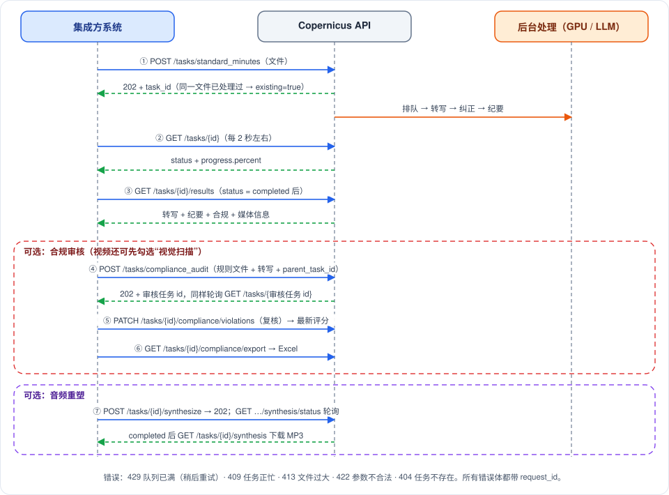

# Copernicus 第三方系统接入指南

> 作者: afu
>
> Copernicus 是音视频听写与合规审核后端，通过 REST API 提供转写、纪要、合规审核和音频重塑能力；所有耗时操作都是异步任务，"提交、轮询、取结果"三步即可接入。
>
> **阅读对象**：需要把 Copernicus 接入自有系统的后端或前端集成开发者。本文只讲调用方式、顺序与错误处理，不涉及服务内部实现和部署。文中不含代码示例，请求与响应用字段表格说明；在线的完整接口定义可在服务的 `/docs` 页面查看。

## 一、你需要知道的三件事

Copernicus 的转写、纪要和审核都要跑几十秒到几十分钟，所以接口不会"等结果再返回"，而是先返回一个任务编号 `task_id`（32 位小写十六进制字符串），你拿着它去查进度、取结果。这种模式叫**异步任务**，反复查询进度的动作叫**轮询**。

**最小可用集成只有三步：**

1. **提交**：向 `POST /api/v1/tasks/standard_minutes` 以 multipart 表单上传一个音频或视频文件（字段名 `file`）。服务返回 HTTP 202 和 `task_id`。
2. **轮询**：每 2 到 5 秒请求一次 `GET /api/v1/tasks/{task_id}`，读取 `status`。当 `status` 变为 `completed` 或 `failed` 时停止；`failed` 时原因在 `error` 字段。
3. **取结果**：`status` 为 `completed` 后请求 `GET /api/v1/tasks/{task_id}/results`，得到转写文本（含说话人和时间戳）和会议纪要。

只要转写文本、不要纪要时，第 1 步改用 `POST /api/v1/tasks/transcript`，其余不变。

图中的步骤 1 到 3 就是最小集成；步骤 4 到 7 是可选能力（合规审核、人工复核、导出、音频重塑），在第三章和第五章展开。上手前还有三点要先知道：

- **相同文件不会重复处理**。服务按文件内容的 SHA-256 哈希识别文件（SHA-256 是把文件内容压缩成 64 位十六进制指纹的算法），同一文件再次提交时直接返回已有任务，响应里 `existing` 为 `true`。
- **服务可能拒绝新任务**。音视频任务排队加运行的数量有上限（默认 5），超出时返回 429，需要稍后重试。
- **系统没有鉴权**。请只在内网或受控网关后面使用，详见第二章。

## 二、约定

### 2.1 基址与数据格式

- 基址为 `http://<host>:<port>`（端口以部署为准），所有接口路径以 `/api/v1` 开头。
- 文件与表单类接口使用 `multipart/form-data`；分片上传的数据块使用 `application/octet-stream`；复核、重命名、校对、合成等接口使用 JSON 请求体；`/evaluate/transcript/async` 使用 `text/plain` 请求体。
- 响应均为 JSON，例外是下载类接口（媒体、关键帧、合成音频、Excel 报告）。布尔类表单字段传 `true` 或 `false`。
- 任务编号 `task_id` 与分片上传的文件哈希有固定格式：`task_id` 为 32 位小写十六进制，哈希为 64 位小写十六进制。格式非法时多数接口返回 422，个别查询接口返回 404。

### 2.2 认证

**系统目前没有任何鉴权机制**：不校验 API Key、令牌或来源身份，任何能访问到端口的调用方都能提交任务、读取和删除结果。因此建议：

- 部署在内网，或放在带鉴权、限流的网关或反向代理之后，由网关负责身份校验。
- 跨域限制（CORS）只约束浏览器，白名单由部署方通过 `CORS_ORIGINS` 配置；服务端到服务端的调用不受其影响。

### 2.3 错误响应格式

所有错误响应的响应头都带 `X-Request-ID`，用于把一次请求与服务端日志对应起来。你可以在请求头中自带该值（1 到 64 位字母、数字或 `._-`），不合法或缺失时服务端自动生成。报障时请提供这个值。

错误响应体有两种形态，集成时需要都能解析：

| 形态 | 字段 | 出现的场景 |
|---|---|---|
| 带机器可读代码 | `detail`（文字说明）、`code`（错误代码）、`request_id` | 任务不存在、任务忙、队列已满、标识格式非法、服务未就绪、内部错误 |
| 仅说明 | `detail` | 其余由接口直接判定的错误，如文件过大、分片偏移不符、哈希不一致、参数校验失败 |

参数校验失败时（如缺少必填字段），`detail` 是一个数组，每项描述一个出错字段，而不是字符串。

`code` 取值如下：

| code | HTTP 状态码 | 含义 |
|---|---|---|
| `task_not_found` | 404 | 任务不存在（含关联的父任务不存在） |
| `media_not_found` | 404 | 任务的原始媒体已不存在，无法重新转写 |
| `task_busy` | 409 | 任务正在运行，或当前阶段不允许该操作 |
| `invalid_identifier` | 422 | `task_id` 或文件哈希格式非法 |
| `queue_full` | 429 | 音视频任务队列已满 |
| `service_not_configured` | 503 | 依赖的服务未初始化 |
| `internal_error` | 500 | 服务内部错误；`detail` 不含内部细节，请用 `request_id` 排查 |

不要只依赖 `detail` 的文字做逻辑判断，文字可能调整；优先使用 HTTP 状态码，有 `code` 时再结合 `code`。

### 2.4 幂等与去重

- **同文件去重**：表单上传和分片上传都会计算整个文件的 SHA-256。哈希命中已有任务时，不再创建新任务，返回已有 `task_id`，`existing` 为 `true`，`status` 是该任务当前的真实状态（可能还在处理中，也可能已完成）。
- **失败任务不复用**：命中的任务如果已经失败，哈希索引会被清除，同一文件重新提交会创建新任务。
- **上传前预检**：`GET /api/v1/tasks/lookup?hash=...` 可以在不传文件的情况下查询哈希是否已有任务，命中返回 200，未命中返回 404，适合大文件先查后传。
- **哈希必须正确**：对文件原始二进制内容计算 SHA-256，输出 64 位小写十六进制。用文本模式读文件、对 base64 后的内容计算、输出大写，都会导致查不到或校验失败。
- **强制重新处理**：先调用 `DELETE /api/v1/tasks/{task_id}` 作废缓存，见 3.3。

### 2.5 限流与排队

- 只对音视频任务（表单上传、分片上传和 `rerun-transcript` 触发的转写）计数，"排队中加运行中"的数量达到 `TASK_MAX_ACTIVE`（默认 5）后，新的提交返回 **429**。该值设为 0 表示不限制。合规审核和文本评估任务不占这个名额。
- 语音识别在同一时刻只处理一个任务，其余任务排队，因此排队任务越多，后面的任务越慢。任务从提交起有超时时间（默认 3600 秒），排队时间也算在内。
- 表单上传是"先收完整个文件，再检查队列"，队列已满时大文件会白传一遍。大文件建议走分片上传：新建会话时就会检查队列，已满直接返回 429。

## 三、端点参考

### 3.1 提交任务

| 方法与路径 | 作用 | 成功状态码 |
|---|---|---|
| `POST /api/v1/tasks/standard_minutes` | 提交音视频，转写、纠错，并自动生成纪要（主入口） | 202 |
| `POST /api/v1/tasks/transcript` | 提交音视频，只转写与纠错，不生成纪要 | 202 |
| `GET /api/v1/tasks/lookup` | 按文件哈希预检是否已有任务 | 200 |
| `GET /api/v1/uploads/{file_hash}` | 分片上传：查询或创建上传会话，取得断点偏移 | 200 |
| `PATCH /api/v1/uploads/{file_hash}` | 分片上传：追加一个数据块，末块自动提交任务 | 200 |

**表单上传的请求字段**（`standard_minutes` 与 `transcript` 共用，`multipart/form-data`）：

| 字段 | 类型 | 是否必填 | 说明 |
|---|---|---|---|
| `file` | 文件 | 是 | 音频或视频文件，大小上限由 `MAX_UPLOAD_SIZE_MB` 决定，默认 500 MB |
| `hotwords` | 字符串 | 否 | 热词表，内容是 JSON 字符串数组（如包含公司名、产品名），最多 200 个，每个不超过 100 字符；用于提升专有名词识别 |
| `visual_scan` | 布尔 | 否 | 是否对视频做视觉扫描（提取关键帧、OCR 文字识别、人脸检测），默认 `false`；对音频文件无效 |
| `generate_summary` | 布尔 | 否 | 仅 `standard_minutes`：转写后是否生成纪要，默认 `true` |
| `template_id` | 字符串 | 否 | 仅 `standard_minutes`：纪要模板 ID，默认 `universal`；不存在的 ID 会自动回退到通用模板，不报错 |

**提交响应**（两个提交端点、评估、合规提交和重新转写共用）：

| 字段 | 类型 | 说明 |
|---|---|---|
| `task_id` | 字符串 | 任务编号 |
| `status` | 字符串 | 新任务为 `pending`；`existing` 为 `true` 时是已有任务的当前状态 |
| `existing` | 布尔 | `true` 表示哈希命中了已有任务，没有创建新任务 |

**关键注意事项：**

- 上传体积超过上限返回 413。服务边收边写盘，不会把整个文件读进内存，但超限会在收到超出部分时立即中断。
- 服务只按扩展名区分视频，默认视频扩展名为 `.mp4`、`.avi`、`.mov`、`.mkv`、`.flv`、`.wmv`，其余按音频处理；不做格式白名单校验，能否解码取决于服务端 ffmpeg，无法解码的文件会使任务变为 `failed`。
- 提交成功返回时文件已保存到服务端，此后客户端断开也不影响任务运行。
- `hotwords` 不是合法 JSON 数组、数量或长度超限时返回 422。
- 命中去重时，`existing` 为 `true`，此时 `hotwords`、`template_id` 等参数不会生效（沿用已有任务）。若想换模板重新生成纪要，见 3.5。

**分片上传**适合大文件（前端在超过 20 MB 时切换到分片），支持断点续传。表单上传与分片上传的差别、以及各状态码出现的位置见下图：

分片上传的流程是：先用 `GET` 建立会话并得到偏移量，再按偏移量循环 `PATCH` 发送数据块，服务端收到最后一块后校验整体哈希并自动提交标准纪要任务。

`GET /api/v1/uploads/{file_hash}` 的参数（`file_hash` 是文件的 SHA-256）：

| 字段 | 位置 | 类型 | 是否必填 | 说明 |
|---|---|---|---|---|
| `file_hash` | 路径 | 字符串 | 是 | 文件 SHA-256，64 位小写十六进制 |
| `filename` | 查询 | 字符串 | 是 | 原始文件名，必须带扩展名（用于区分音视频） |
| `total_size` | 查询 | 整数 | 是 | 文件总字节数，不得超过上传上限 |
| `hotwords` | 查询 | 字符串，可重复 | 否 | 每个热词一个 `hotwords` 参数，限制同上 |
| `visual_scan` | 查询 | 布尔 | 否 | 默认 `false` |
| `generate_summary` | 查询 | 布尔 | 否 | 默认 `true` |
| `template_id` | 查询 | 字符串 | 否 | 纪要模板 ID，默认 `universal`；会话会记住它，末块完成后用于生成纪要 |

`GET /api/v1/uploads/{file_hash}` 的响应：

| 字段 | 类型 | 说明 |
|---|---|---|
| `offset` | 整数 | 服务端已收到的字节数，客户端从这里继续发送；新会话为 0 |
| `complete` | 布尔 | `true` 表示服务端已有这个文件对应的任务，不必再上传，此时 `offset` 等于 `total_size` |
| `task_id` | 字符串 | 仅 `complete` 为 `true` 时有值；该任务可能仍在处理中，需要继续轮询 |

`PATCH /api/v1/uploads/{file_hash}` 的请求与响应：

| 项目 | 说明 |
|---|---|
| 请求头 `Content-Range` | 必填，格式 `bytes 起始-结束/总长`。服务端只使用"起始"，它必须等于服务端已收到的字节数 |
| 请求体 | 该数据块的原始二进制，不能为空 |
| 响应 `received` | 服务端累计收到的字节数 |
| 响应 `complete` | 是否已收完；最后一块处理成功时为 `true` |
| 响应 `task_id` | 仅最后一块成功时有值 |

分片上传的要点：

- **块大小**：建议每块 5 MB；服务端允许的单块上限为 64 MB，超过返回 413。
- **断点续传**：网络中断或不确定某块是否成功时，重新调用 `GET` 取得最新 `offset`，从该位置继续。同一文件的分块在服务端是串行处理的。
- **热词与开关**：`hotwords`、`visual_scan`、`generate_summary` 以最近一次 `GET` 的值为准，续传时请保持一致。
- **偏移不符返回 409**：起始位置不等于服务端已收字节数，或块超出声明的总大小。处理方式是重新 `GET` 取偏移量再发送。
- **末块前先检查队列**：队列已满时返回 429，且该数据块尚未写入，稍后**原样重传**同一块即可。
- **整体哈希不一致返回 422**：服务端会丢弃整个会话，需要从 `GET` 重新开始，并检查哈希计算方式。
- **会话不存在返回 404**：没有先调用 `GET`，或会话已被清理，请重新 `GET`。
- 请求头缺失或格式错误、请求体为空返回 400；会话无活动超过 `MEDIA_RETENTION_HOURS`（默认 24 小时）后被清理。

### 3.2 查询状态与结果

| 方法与路径 | 作用 | 成功状态码 |
|---|---|---|
| `GET /api/v1/tasks/{task_id}` | 查询任务状态与进度（轮询用） | 200 |
| `GET /api/v1/tasks/{task_id}/results` | 一次取回该任务已保存的全部结果 | 200 |
| `GET /api/v1/tasks/{task_id}/media` | 下载原始媒体（有视频返回视频，否则返回音频） | 200 |
| `GET /api/v1/tasks/{task_id}/frames/{filename}` | 下载一张关键帧图片（JPEG） | 200 |

**状态查询的响应字段：**

| 字段 | 类型 | 说明 |
|---|---|---|
| `task_id` | 字符串 | 任务编号 |
| `status` | 字符串 | 取值见第四章 |
| `progress.percent` | 浮点数 | 0 到 100 的进度百分比，换算规则见第四章 |
| `progress.current_chunk` / `progress.total_chunks` | 整数 | 当前阶段已完成批次与总批次，未知时为 0 |
| `result` | 对象或空 | 任务完成后的结果，类型随任务种类而不同，见下 |
| `error` | 字符串或空 | 仅 `failed` 时有值，是失败或取消原因 |

`result` 的内容：转写任务与标准纪要任务，`result` 是**转写结果**（纪要不在这里，要从 `results` 读取）；文本评估任务是纪要结果；合规审核任务是合规报告。对音视频任务，建议一律用 `results` 取最终内容。

**`results` 的响应字段：**

| 字段 | 类型 | 说明 |
|---|---|---|
| `task_id` | 字符串 | 任务编号 |
| `transcript` | 对象或空 | 转写结果，未完成时为空 |
| `evaluation` | 对象或空 | 纪要结果；未生成或生成失败时为空 |
| `compliance` | 对象或空 | 合规审核结果；未提交审核时为空 |
| `has_audio` / `has_video` | 布尔 | 原始音频、视频是否仍在服务端 |
| `has_synthesis` | 布尔 | 是否已有合成音频 |
| `keyframe_count` | 整数 | 提取的关键帧数量 |
| `ocr_text_count` | 整数 | OCR 识别出的文字记录数 |
| `visual_event_count` | 整数 | 视觉事件数（人脸出现、人脸缺失、场景切换） |

`transcript` 对象的字段：

| 字段 | 类型 | 说明 |
|---|---|---|
| `transcript` | 数组 | 句段列表，每项含 `timestamp`（形如 05:20，分:秒）、`timestamp_ms`、`end_ms`、`speaker`（说话人标签）、`text`（原始识别文本）、`text_corrected`（纠错后文本） |
| `processing_time_ms` | 浮点数 | 处理耗时 |
| `correction_total_batches` | 整数 | 文本纠错被分成的批次数 |
| `correction_failed_batches` | 整数 | 纠错失败的批次数；大于 0 表示有部分句段没有经过润色，`text_corrected` 沿用原始识别文本，属于降级结果 |

`evaluation` 对象的字段：

| 字段 | 类型 | 说明 |
|---|---|---|
| `title` | 字符串 | 会议标题 |
| `formatted_content` | 字符串 | 按模板排版的 Markdown 纪要正文 |
| `truncated` | 布尔 | `true` 表示文本过长被截断，纪要只基于前部内容 |
| `degraded_chunks` | 整数 | 分段提炼失败、改用原文片段兜底的段数；大于 0 表示纪要质量有所下降 |
| `action_items` | 数组 | 行动项：`task`（事项）、`owner`（负责人，可为空串）、`due`（时间要求，可为空串）、`timestamp_ms`（在转写中的位置，没能定位时为 `null`） |
| `decisions` | 数组 | 决议：`content`、`timestamp_ms`（同上） |
| `structure_status` | 字符串 | 结构化提取的完整性：`ok`、`partial`（部分分块失败，列表可能不全）、`failed`（提取失败，列表为空不代表没有）、`skipped`（未启用或没有转写可用；旧数据也是此值） |

**关键注意事项：**

- **任务不存在返回 404**。已完成任务在内存中被淘汰后会自动从磁盘恢复，不受影响；但**合规审核和文本评估任务没有独立的磁盘目录**，其 `task_id` 只在服务内存中有效，服务重启后查询会得到 404。所以提交这两类任务时应带上 `parent_task_id`，让结果写入父任务，再通过父任务的 `results` 读取。
- `results` 对没有磁盘目录的任务返回 404；对刚提交、尚无结果的任务，各结果字段为空而不是报错。
- 任务已 `completed` 但 `evaluation` 为空，通常是纪要阶段失败（纪要失败不会让任务失败，转写仍可用）或提交时关闭了 `generate_summary`，可按 3.5 单独重新生成。
- 关键帧文件名形如 `frame_0001.jpg`（只允许字母、数字、`_`、`.`、`-`，否则 422，不存在 404），合规报告违规条目的 `evidence_url` 就是这个文件名。
- 原始媒体超过保留期会被清理，`media` 此时返回 404；关键帧与 JSON 结果不受影响。

### 3.3 任务管理

| 方法与路径 | 作用 | 成功状态码 |
|---|---|---|
| `GET /api/v1/tasks` | 历史任务列表，按创建时间倒序 | 200 |
| `PATCH /api/v1/tasks/{task_id}` | 重命名任务 | 204 |
| `DELETE /api/v1/tasks/{task_id}` | 作废缓存，或彻底删除任务 | 204 |
| `POST /api/v1/tasks/{task_id}/cancel` | 取消尚可中断的任务 | 202 |
| `POST /api/v1/tasks/{task_id}/rerun-transcript` | 对已保存的媒体重新转写 | 200 |
| `PATCH /api/v1/tasks/{task_id}/transcript` | 人工修订转写文本 | 200 |
| `PATCH /api/v1/tasks/{task_id}/speakers` | 重命名或合并说话人 | 200 |

各端点参数：

| 端点 | 参数 | 类型 | 是否必填 | 说明 |
|---|---|---|---|---|
| `GET /tasks` | `limit`（查询） | 整数 | 否 | 返回条数，1 到 500，默认 100 |
| `PATCH /tasks/{id}` | `name`（JSON） | 字符串 | 是 | 新名称，1 到 100 字符，首尾空白会被去掉 |
| `DELETE /tasks/{id}` | `purge`（查询） | 布尔 | 否 | 默认 `false`；`true` 为彻底删除 |
| `POST /tasks/{id}/rerun-transcript` | `hotwords`（表单） | 字符串 | 否 | 同 3.1 的热词格式 |
| `PATCH /tasks/{id}/transcript` | `edits`（JSON） | 数组 | 是 | 1 到 2000 项，每项含 `index`（句段下标，从 0 起）与 `text_corrected`（不超过 5000 字符） |
| `PATCH /tasks/{id}/speakers` | `renames`（JSON） | 对象 | 是 | 1 到 50 项，键为原说话人标签，值为新名称（不能为空，不超过 50 字符） |

`GET /tasks` 的响应含 `tasks` 数组与 `total`（磁盘上的任务总数，大于返回条数说明被 `limit` 截断）。每个条目含 `task_id`、`name`、`filename`、`created_at`、`status`、`error`、`has_video`、`has_evaluation`、`has_compliance`。`name` 的优先级为：用户重命名，其次纪要标题，最后原始文件名。

**关键注意事项：**
- **DELETE 有两种语义**：
  - 默认（`purge` 为 `false`）：只作废服务内存中的任务缓存和哈希索引，**磁盘文件保留**。作废后同一文件再次提交不会命中去重，会重新走完整流水线。作废是内存状态，服务重启后任务会从磁盘恢复。
  - `purge` 为 `true`：彻底删除，原始媒体、转写、纪要、合规报告与关键帧全部移除，**不可恢复**。
  - 两种方式在任务仍在运行时都返回 **409**；`purge` 为 `true` 时若该任务的音频合成正在进行也返回 409。任务不存在返回 404。
- **取消（cancel）只在部分阶段可用**：允许在排队（`pending`）、等待语音识别（`queued_asr`）、文本纠正（`correcting`）、生成纪要（`evaluating`）和合规审核（`auditing`）阶段取消；语音识别、抽帧、视觉扫描阶段跑在线程里无法中断，返回 409，请等待该阶段结束后再取消。已结束的任务取消同样返回 409。取消成功后任务变为 `failed`，`error` 为"任务已取消"。若在纪要阶段取消，转写结果已经保存，仍可通过 `results` 读取，但任务状态是 `failed`。
- **重新转写**成功返回 200 与 `pending` 状态（响应结构同 3.1 的提交响应，`task_id` 不变）。要求任务已结束（否则 409）且原始媒体仍在（否则 404，`media_not_found`），队列已满返回 429。重新转写会**清除旧的纪要与合规报告**，且不会自动重新生成纪要，也不会重新做视觉扫描（已有的关键帧与 OCR 数据保留）。
- **校对接口**只允许已完成的任务（否则 409）。文本修订只改 `text_corrected`，原始 `text` 不变；越界下标和内容未变化的句段被忽略。两个接口都返回 `updated`（实际变更的条数），且立即持久化。已生成的纪要与合规报告**不会自动重算**，需要重新生成。

### 3.4 合规审核

合规审核是对**已有转写文本**按一份规则文件逐条检查，找出可能违规的片段。它是独立的任务，可对任何有转写结果的任务发起。

| 方法与路径 | 作用 | 成功状态码 |
|---|---|---|
| `POST /api/v1/tasks/compliance_audit` | 提交合规审核任务 | 202 |
| `PATCH /api/v1/tasks/{task_id}/compliance/violations` | 批量更新违规条目的人工复核状态 | 200 |
| `GET /api/v1/tasks/{task_id}/compliance/export` | 导出 Excel 报告 | 200 |

提交合规审核的请求字段（`multipart/form-data`）：

| 字段 | 类型 | 是否必填 | 说明 |
|---|---|---|---|
| `rules_file` | 文件 | 是 | 规则文件，CSV 或 XLSX，不超过 2 MB |
| `transcript` | 字符串 | 是 | 转写条目的 JSON 数组字符串，UTF-8 编码后不超过 500 KB，且不能为空数组 |
| `parent_task_id` | 字符串 | 否 | 关联的转写任务 ID；填写后审核结果写入该任务，并自动读取它的 OCR 数据参与审核 |

**关键注意事项：**

- **规则文件**：第一列是规则，形如"编号加内容"（例如 `4全程双录：……` 这种以数字开头的写法），没有编号时按行序编号；同一行第二列起的文字被当作历史检查结果，作为示例提供给审核模型；表头行（含"序号""标准""检查"等字样）会被跳过。CSV 会依次尝试 UTF-8、GBK、GB18030 解码，XLSX 读取第一个工作表。规则文件解析在后台进行，格式有问题时不会同步报错，而是任务变为 `failed`，原因在 `error`。
- **`transcript`**：取 `results` 中 `transcript.transcript` 数组原样序列化传入。服务端按每项的 `text_corrected` 读取正文，因此该字段必须存在；`timestamp`、`timestamp_ms`、`end_ms`、`speaker` 用于违规定位，建议一并保留。第三方自有转写请按这个条目结构组织。
- **`parent_task_id` 不存在返回 404**（`task_not_found`），在开始审核之前就会拒绝，不会浪费算力。
- **视觉证据**：只有对视频提交时勾选了 `visual_scan`，并在合规提交时填写 `parent_task_id`，审核才会用到 OCR 屏幕文字。没有 OCR 数据时，依赖屏幕文字的规则会被跳过（见下面的 `skipped_rule_ids`）。人脸检测事件会被保存，但目前不参与合规判定。
- 文本超过 5 万字时会被截断并在报告中标记；所有分块都审核失败时任务变为 `failed`。
- 提交后按 `task_id` 轮询，状态为 `auditing`，完成后 `result` 就是合规报告；带了 `parent_task_id` 时也可通过父任务的 `results` 读取。审核任务的 `task_id` 在服务重启后会失效（见 3.2），所以带上 `parent_task_id` 更稳妥。

**合规报告结构**（`compliance`，即轮询时的 `result`）：

| 字段 | 类型 | 说明 |
|---|---|---|
| `rules` | 数组 | 解析出的规则，每项含 `id`、`content` |
| `report.total_rules` | 整数 | 规则数 |
| `report.total_segments` / `report.total_segments_checked` | 整数 | 转写句段总数与实际审核句段数；两者不等说明被截断 |
| `report.truncated` | 布尔 | 文本是否被截断 |
| `report.total_chunks` / `report.failed_chunks` | 整数 | 审核分块数与失败数；`failed_chunks` 大于 0 表示只完成了部分审核，不能把"没有违规"当作"合规" |
| `report.skipped_rule_ids` | 整数数组 | 因缺少证据来源（如没有 OCR 数据）而**未审核**的规则编号；这些规则不代表已通过 |
| `report.violations` | 数组 | 违规条目，字段见下 |
| `report.summary` | 字符串 | 文字总结 |
| `report.compliance_score` | 浮点数 | 合规评分，100 分起扣：高危 15、中危 8、低危 3，人工驳回的条目不扣分 |
| `report.source_counts` | 对象 | 各证据来源的违规条数 |
| `processing_time_ms` | 浮点数 | 审核耗时 |

违规条目的主要字段：`id`（报告内稳定唯一，形如 `v0001`）、`rule_id`、`rule_content`、`reason`、`reasoning`（推理过程）、`severity`（`high`、`medium`、`low`）、`confidence`（置信度）、`status`（`pending` 待审、`confirmed` 已确认、`rejected` 已驳回）、`timestamp`、`timestamp_ms`、`end_ms`、`speaker`、`original_text`、`source`（`transcript`、`ocr`、`vision`）、`evidence_url`（关键帧文件名，可用 3.2 的 `frames` 下载）、`evidence_text`（相关的屏幕文字）、`reviewed_at`（复核时间）、`review_note`（复核备注）。

**人工复核**（`PATCH .../compliance/violations`）的请求与响应：

| 字段 | 类型 | 是否必填 | 说明 |
|---|---|---|---|
| `updates` | 数组 | 是 | 批量更新列表 |
| `updates[].violation_id` | 字符串 | 与 `index` 二选一 | 违规条目的 `id`，推荐使用 |
| `updates[].index` | 整数 | 与 `violation_id` 二选一 | 列表下标，已废弃，仅为兼容旧客户端保留 |
| `updates[].status` | 字符串 | 是 | `pending`、`confirmed`、`rejected` 之一 |
| `updates[].note` | 字符串 | 否 | 复核备注，最长 500 字符 |
| 响应 `ok` | 布尔 | - | 恒为 `true` |
| 响应 `updated` | 整数 | - | 成功更新的条数 |
| 响应 `missing` | 字符串数组 | - | 没有匹配到的条目标识，不影响其余条目的更新 |
| 响应 `compliance_score` | 浮点数 | - | 复核后重新计算的评分 |

复核说明：确认或驳回会记录 `reviewed_at`，改回 `pending` 会清空复核留痕；更新立即写入服务端，刷新页面后仍保留。任务没有合规报告时返回 404，两个标识都没提供返回 422。

**导出**返回 Excel 文件，含"概览"和"违规明细"两个工作表，包含复核状态、时间与备注；没有合规报告时返回 404。

### 3.5 文本评估与纪要模板

已经有转写文本时，可以不经过语音识别，直接生成纪要。纪要长文本按"分段提炼、再汇总"的方式生成：

| 方法与路径 | 作用 | 成功状态码 |
|---|---|---|
| `POST /api/v1/evaluate/text/async` | 对一段文本生成纪要，可指定模板 | 202 |
| `POST /api/v1/evaluate/transcript/async` | 接收第三方转写原文，用通用模板生成纪要 | 202 |
| `GET /api/v1/templates` | 查询可用纪要模板 | 200 |
| `POST /api/v1/templates/reload` | 重新加载模板目录，无需重启服务 | 200 |

`POST /evaluate/text/async` 的请求字段（`multipart/form-data`）：

| 字段 | 类型 | 是否必填 | 说明 |
|---|---|---|---|
| `text` | 字符串 | 是 | 待生成纪要的文本，不能为空白，UTF-8 编码后不超过 500 KB |
| `template_id` | 字符串 | 否 | 默认 `universal`；不存在的 ID 会自动回退到通用模板，不报错 |
| `parent_task_id` | 字符串 | 否 | 填写后纪要写入该任务，可通过它的 `results` 读取；该任务不存在返回 404 |

`POST /evaluate/transcript/async` 的请求体是 `text/plain` 原文（UTF-8），不带表单字段，不支持模板和父任务。支持两种内容：第三方格式，即方括号时间戳后接 JSON，例如以 `[2026-04-17 14:29:37]` 开头，后面紧跟一个含 `content` 字段的 JSON 对象，服务端取出 `content` 作为正文；或者直接是纯文本。空文本返回 422，超过 500 KB 返回 413。

两个评估端点都返回标准提交响应；轮询时 `status` 依次为 `pending`、`evaluating`、`completed`，`result` 含 `raw_text`、`corrected_text`、`evaluation`（同 3.2 的纪要对象）与 `processing_time_ms`。文本超过 5 万字时会截断并置 `truncated` 为 `true`。

`GET /templates` 返回数组，每项含 `id`、`name`、`description`，提交前调用一次即可得到合法的 `template_id`。`POST /templates/reload` 返回 `reloaded`（加载的模板数）和 `templates`（同上的元数据列表）；正在运行的任务不受影响。模板由部署方在服务器的 `templates/` 目录维护。

### 3.6 音频重塑

音频重塑把已有转写按说话人合成为一段多人对话的 MP3。它是独立的异步任务，有自己的状态接口。

| 方法与路径 | 作用 | 成功状态码 |
|---|---|---|
| `POST /api/v1/tasks/{task_id}/synthesize` | 提交合成任务 | 202 |
| `GET /api/v1/tasks/{task_id}/synthesis/status` | 查询合成状态 | 200 |
| `GET /api/v1/tasks/{task_id}/synthesis` | 下载合成后的 MP3 | 200 |

提交合成的请求体是可选的：可以不带请求体，也可以带一个 JSON 对象，只写需要的字段：

| 字段 | 类型 | 是否必填 | 说明 |
|---|---|---|---|
| `voice_map` | 对象 | 否 | 说话人标签到音色标识（字符串）的映射；未指定的说话人自动分配音色 |

响应字段（提交与状态查询共用）：

| 字段 | 类型 | 说明 |
|---|---|---|
| `status` | 字符串 | `running`、`completed`、`failed` |
| `audio_url` | 字符串 | 仅 `completed`：下载路径 |
| `duration_ms` | 浮点数 | 仅 `completed`：音频时长（毫秒） |
| `synthesis_time_ms` | 浮点数 | 仅 `completed`：合成耗时（毫秒） |
| `error` | 字符串 | 仅 `failed`：失败原因 |

**关键注意事项：**

- 前置条件是目标任务已有转写结果：没有则返回 404，转写为空返回 422。
- 合成需要独占显存：若当前有任务处于纪要、文本纠正或合规审核阶段，返回 **503**，稍后重试；同一任务已有合成在进行返回 **409**，直接轮询状态即可；合成服务未就绪也返回 503。
- 合成失败后可再次提交；服务重启后会从磁盘恢复"已完成"状态；从未合成过的任务，查询状态与下载都返回 404。合成音频的保留时间与原始媒体相同。

### 3.7 系统与健康

| 方法与路径 | 作用 | 成功状态码 |
|---|---|---|
| `GET /api/v1/health/live` | 存活探针：只表示进程在响应，不检查依赖 | 200 |
| `GET /api/v1/health` | 就绪与组件状态、任务统计、显存水位 | 200 |
| `GET /metrics` | Prometheus 文本格式指标（**不在 `/api/v1` 之下**，Nginx 不转发，只能直连后端端口） | 200 |

存活探针的响应只有一个 `status` 字段，值为 `alive`。
`/health` 的响应字段：

| 字段 | 类型 | 说明 |
|---|---|---|
| `status` | 字符串 | 整体状态：`healthy` 或 `degraded`。`unhealthy` 是保留值，当前不会返回 |
| `asr` | 对象 | 语音识别组件，含 `status`（`ok`、`degraded`、`down`）与可选的 `detail` |
| `llm` | 对象 | 大语言模型是否可达，`ok` 或 `down` |
| `tts` | 对象或空 | 语音合成组件，未启用时为空 |
| `tasks` | 对象 | 任务统计：`active`、`completed`、`failed`、`synthesis_running` |
| `vram` | 对象或空 | 显存水位：`loaded_models`、`estimated_used_gb`、`budget_gb` |

**关键注意事项：**

- **健康检查不再返回 503**，即使有组件异常，HTTP 状态码也是 200，需要读取 `status` 与各组件状态判断。
- `asr` 为 `degraded` 通常只表示识别模型权重暂时被卸载（例如给合成腾显存），下一次转写会自动重新加载，并不影响提交任务，只是第一个任务会慢一些。
- `llm` 为 `down` 时，纪要、合规审核和文本纠错会受影响：纠错会降级为沿用原始识别文本，纪要可能缺失，合规审核会失败。
- `tasks.active` 含合规审核和文本评估任务，不等于 429 所针对的音视频任务数，只能粗略参考；`vram.estimated_used_gb` 只统计服务自己管理的模型。

## 四、任务状态与进度的含义

任务的 `status` 取值与含义：

| status | 含义 | 出现在 |
|---|---|---|
| `pending` | 已提交，排队中 | 所有任务 |
| `extracting_frames` | 视频预处理：提取音轨、抽取关键帧 | 视频任务 |
| `scanning_visual` | 视觉扫描：OCR 与人脸检测 | 勾选 `visual_scan` 的视频任务 |
| `queued_asr` | 已轮到语音识别，但识别模型正被别的任务占用，等待中（可取消） | 音视频任务，仅在 ASR 忙时出现 |
| `processing_asr` | 语音识别与说话人区分 | 音视频任务 |
| `correcting` | 文本纠错 | 音视频任务 |
| `evaluating` | 生成纪要 | 标准纪要任务与文本评估任务 |
| `auditing` | 合规审核 | 合规审核任务 |
| `completed` | 已完成 | 所有任务 |
| `failed` | 已失败或被取消，原因见 `error` | 所有任务 |

上图中，音频文件会跳过抽帧与视觉扫描，只转写的任务在纠正后直接完成，合规审核和文本评估是独立任务，只经过自己的阶段。服务重启后，磁盘上已有转写结果的任务恢复为 `completed`，只剩媒体、没有结果的任务恢复为 `failed`（提示服务重启导致中断），可通过重新转写恢复。

**终止条件与轮询建议：**
- 只有 `completed` 和 `failed` 是终止状态，其余状态都应继续轮询；不要用进度百分比是否到 100 判断结束。
- 建议间隔 2 到 5 秒；任务长时可逐步拉长到 10 秒左右。任务从提交起有超时时间（默认 3600 秒，含排队），超时后变为 `failed`，`error` 说明超时。

音视频任务处理经过的阶段如下：

进度百分比由服务端按状态和批次换算：

图中只标了各状态的大致区间，有几点需要补充：

- 换算是分段的：视频的抽帧与视觉扫描占前 20%，语音识别固定为 20%，文本纠正按批次从 20% 推进到 90%，生成纪要占最后 10%。音频任务没有前两段，从 20% 起步。文本评估与合规审核任务的百分比则按各自批次从 0 推进到 100。
- **百分比可能短暂回落**：每次进入新阶段，批次计数会重置，进度可能先回到 0 或阶段起点，再随批次前进；`failed` 时百分比为 0。请把它当作进度条参考，不要用它做逻辑判断，判断以 `status` 为准。

## 五、常见集成场景

以下场景用文字步骤描述，字段说明见第三章。

### 5.1 只要转写文本

1. 调用 `POST /tasks/transcript` 上传文件；文件较大时改用分片上传（但分片上传总会生成纪要，若不需要可在 `GET` 时把 `generate_summary` 设为 `false`）。
2. 轮询 `GET /tasks/{task_id}` 直到 `completed`。
3. 读取 `GET /tasks/{task_id}/results` 的 `transcript.transcript`。若 `correction_failed_batches` 大于 0，说明有句段没有润色，可按需提示用户。

### 5.2 要会议纪要

1. 可先调用 `GET /templates` 选定 `template_id`。
2. 调用 `POST /tasks/standard_minutes`，带上 `template_id`。
3. 轮询直到 `completed`，用 `results` 读取 `evaluation.title` 与 `evaluation.formatted_content`。同时检查 `evaluation.truncated` 与 `degraded_chunks`，为真或大于 0 时向用户标注纪要不完整。
4. `evaluation` 为空时，用转写全文（把各句段的 `text_corrected` 依次拼接）调用 `POST /evaluate/text/async`，并填写 `parent_task_id`，完成后再从父任务的 `results` 读取。换模板重新生成纪要也用同样的方法。

### 5.3 要合规审核

1. 按 5.1 或 5.2 得到转写结果（任务 `completed`）。
2. 准备规则文件，把 `results` 里的 `transcript.transcript` 序列化为 JSON 字符串，调用 `POST /tasks/compliance_audit`，`parent_task_id` 填转写任务的编号。
3. 轮询返回的审核 `task_id`，`completed` 后从父任务的 `results` 读取 `compliance`。检查 `failed_chunks`、`truncated`、`skipped_rule_ids`，它们非零或非空时，报告只覆盖了一部分。
4. 人工复核时，用 `PATCH .../compliance/violations` 提交确认或驳回，按返回的 `compliance_score` 更新展示；需要归档时调用导出接口取得 Excel。

### 5.4 视频加视觉扫描

1. 提交视频时把 `visual_scan` 设为 `true`（表单或分片上传均可）。状态会额外经过 `extracting_frames` 与 `scanning_visual`。
2. `completed` 后从 `results` 读取 `keyframe_count`、`ocr_text_count`、`visual_event_count`，确认视觉扫描有产出。
3. 提交合规审核时填写 `parent_task_id`，屏幕文字类规则才会参与；违规条目里的 `evidence_url` 可交给 `frames` 端点下载关键帧作为证据。

### 5.5 重新转写

适用于换热词、修正识别效果的场景。

1. 确认任务已结束，且原始媒体仍在保留期内（`results` 的 `has_audio` 或 `has_video` 为真）。
2. 调用 `POST /tasks/{task_id}/rerun-transcript`，可传新的 `hotwords`，任务编号不变。
3. 重新轮询直到 `completed`。之前的纪要与合规报告已被清除，需要按 5.2 第 4 步和 5.3 重新生成。
4. 若媒体已被清理，改为先 `DELETE` 作废缓存，再重新上传同一文件。

### 5.6 接入第三方已有转写

- 只要纪要：调用 `POST /evaluate/text/async`（可选模板），或把第三方转写原文直接推给 `POST /evaluate/transcript/async`（通用模板）。
- 要合规审核：把第三方转写整理成条目数组（至少含 `text_corrected`，建议同时带 `timestamp`、`timestamp_ms`、`end_ms`、`speaker`），直接调用 `POST /tasks/compliance_audit`，不填 `parent_task_id`。此时结果只能通过轮询该审核任务读取，且服务重启后会丢失，请在完成后立即取走。

## 六、错误处理与重试建议

| 状态码 | 常见原因 | 建议动作 |
|---|---|---|
| 400 | 分片上传缺少或写错 `Content-Range`，或数据块为空 | 修正请求后重发，不要盲目重试 |
| 404 | 任务、会话、合规报告、媒体或关键帧不存在；父任务不存在；服务重启后审核和评估任务的编号失效 | 核对编号；需要保留结果时提交时带上 `parent_task_id`；分片上传会话丢失则重新 `GET` 建立 |
| 409 | 任务正在运行（删除、重新转写、校对）；取消所处阶段不可中断；分片偏移不符；同一任务已有合成在进行 | 等待任务结束后重试；分片上传重新 `GET` 取偏移量；合成则直接轮询状态 |
| 413 | 文件超过上限，或分片块过大，或规则文件、文本超过限额 | 缩小内容，不要重试同一请求；限额见第七章 |
| 422 | 参数不合法：热词格式或数量、转写 JSON、空文本、编号格式、整体哈希不一致、必填字段缺失 | 按 `detail` 修正；哈希不一致时从头重新上传并检查哈希算法 |
| 429 | 音视频任务队列已满 | 等待后重试，建议带随机抖动的退避（如 10 秒起步逐步加倍）；分片上传的末块可原样重传 |
| 500 | 服务内部错误 | 记录 `X-Request-ID` 与 `request_id` 后有限次重试，仍失败联系服务方 |
| 503 | 合成时有任务占用 LLM，或服务未就绪 | 稍后重试；先检查 `/health` |

补充建议：
- **网络中断的重试**：不确定提交是否已到达服务端时，先用 `GET /tasks/lookup` 按哈希查询：命中则直接轮询，未命中再重传。因为服务按哈希去重，重复提交同一文件是安全的。
- **只重试可重试的错误**：429、503、网络超时可退避重试；400、413、422 是请求本身有问题，重试无效。
- **任务级失败**：`failed` 的原因写在 `error` 里，常见的有媒体无法解码、任务超时、被取消、服务重启中断；可重新提交同一文件（失败任务不复用）或重新转写。
- **部分降级要显式处理**：`correction_failed_batches`、`evaluation.degraded_chunks`、`evaluation.truncated`、`report.failed_chunks`、`report.truncated`、`report.skipped_rule_ids` 都是"任务成功但结果不完整"的信号，任务状态仍是 `completed`，需要自行判断是否接受。

## 七、限制与注意事项

| 项目 | 限制或说明 |
|---|---|
| 音视频文件大小 | 默认 500 MB，由 `MAX_UPLOAD_SIZE_MB` 决定，表单与分片上传共用；部署方可能调高，超限返回 413 |
| 分片单块大小 | 服务端上限 64 MB，建议 5 MB |
| 规则文件 | 不超过 2 MB，CSV 或 XLSX |
| 合规 `transcript` 与文本评估的文本 | 各不超过 500 KB（UTF-8 字节数） |
| 纪要与审核的处理长度 | 超过 5 万字的文本会被截断，并分别用 `truncated` 标记 |
| 媒体格式与时长 | 不做格式白名单，能否处理取决于服务端 ffmpeg，视频扩展名见 3.1；没有单独的时长限制，实际受任务超时（默认 3600 秒，含排队）约束 |
| 排队上限 | `TASK_MAX_ACTIVE`，默认 5，仅统计音视频任务 |
| 原始媒体保留 | 已完成任务的原始媒体与合成音频保留 `MEDIA_RETENTION_HOURS`（默认 24 小时）后清理；转写、纪要、合规 JSON 与关键帧保留；清理每小时检查一次；失败或被中断且超期的任务整目录清理（至少保留 2 小时） |
| 存储配额 | 部署方可设置 `MAX_STORAGE_GB`，超出时会提前清理最旧的原始媒体，不受保留时间限制 |
| 内存中的任务数 | 最多 500 个；超出后淘汰已结束的任务，有磁盘结果的任务仍可查询 |
| 并发与频率 | 语音识别串行，合规与纪要生成共享有限的大模型并发；建议同一调用方并行提交的音视频任务不超过队列上限，轮询间隔不低于 2 秒 |

- **task_id 即凭据**：由于没有鉴权，`DELETE` 与 `results` 只凭 `task_id`，请不要向不可信方暴露它。
